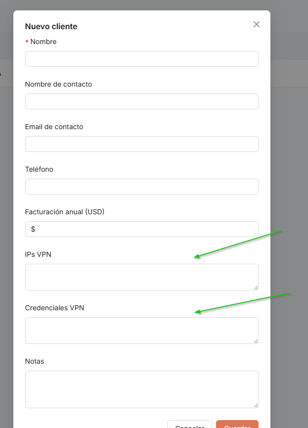
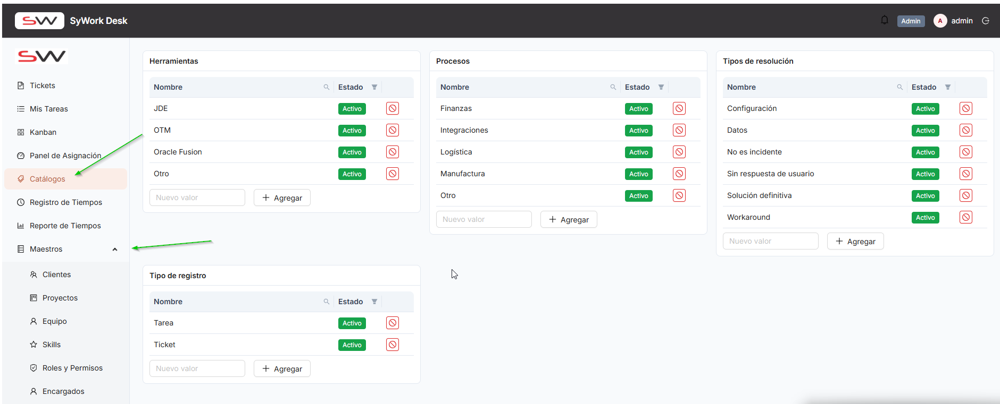

# ITER-001 — Iteración de pruebas

## Objetivo de la iteración

Primera iteración de validación funcional bajo la metodología UAT, previa al inicio de sincronización con git (prevista para socializarse con el desarrollador el 2026-07-10). Revisión general de la aplicación, con foco en el módulo Clientes (pantalla Nuevo Cliente) y la navegación del menú principal.

## Resumen de observaciones

| ID | Módulo/Pantalla | Tipo | Estado | Reportado por |
|---|---|---|---|---|
| OBS-0001 | Clientes > Nuevo Cliente | Mejora | Abierta | Camilo Reyes |
| OBS-0002 | Pantalla Principal > Menú | Mejora | Abierta | Camilo Reyes |

## Detalle de observaciones

<Agrupar por módulo/pantalla. Copiar el bloque siguiente por cada observación — ver formato completo en ../../CONVENTIONS.md.>

### OBS-0001 — Ampliar campos "IPs VPN" y "Credenciales VPN" para soportar múltiples accesos

- **Módulo/Pantalla:** Clientes > Nuevo Cliente
- **Tipo:** Mejora
- **Estado:** Abierta
- **Reportado por:** Camilo Reyes
- **Iteración de origen:** ITER-001
- **Iteración de cierre:** —

**Descripción**
Los campos actuales "IPs VPN" y "Credenciales VPN" son insuficientes: un cliente puede tener varios usuarios de conexión VPN, distintas URLs de sistema por ambiente (DEV, TEST, PROD) con sus propios usuarios y contraseñas, IP/nombre de escritorio remoto con sus propias credenciales, y en algunos casos archivos con el paso a paso de instalación y configuración.

**Resultado esperado / Situación actual**
Situación actual: solo existen dos campos de texto simple ("IPs VPN" y "Credenciales VPN") que no permiten registrar múltiples accesos ni distintos tipos de información de conexión.

**Resultado actual / Propuesta de mejora**
Reemplazar esos dos campos por una sección de "Accesos y conexiones" tipo lista repetible por cliente, donde cada registro tenga al menos: Tipo de acceso (VPN / URL de sistema / Escritorio remoto), Ambiente (DEV/TEST/PROD, cuando aplique), Usuario, Contraseña, IP/URL/host, Notas, y permitir adjuntar archivos (ej. instructivo de instalación/configuración).

**Criterios de aceptación**
- [ ] La pantalla Nuevo/Editar Cliente permite agregar múltiples registros de acceso (no limitado a uno solo).
- [ ] Cada registro permite indicar tipo de acceso (VPN, URL de sistema, Escritorio remoto) y, cuando aplique, el ambiente (DEV/TEST/PROD).
- [ ] Cada registro permite capturar usuario y contraseña de forma independiente.
- [ ] Es posible adjuntar uno o varios archivos (ej. instructivo de instalación/configuración) asociados al cliente.
- [ ] La información previamente capturada en "IPs VPN" y "Credenciales VPN" no se pierde con el cambio.

**Evidencia**

### OBS-0002 — Mover la opción de menú "Catálogos" dentro de "Maestros"

- **Módulo/Pantalla:** Pantalla Principal > Menú
- **Tipo:** Mejora
- **Estado:** Abierta
- **Reportado por:** Camilo Reyes
- **Iteración de origen:** ITER-001
- **Iteración de cierre:** —

**Descripción**
En el menú principal, "Catálogos" aparece como opción de primer nivel, independiente de "Maestros". Para mantener consistencia en la organización de la navegación, debería quedar agrupada dentro de "Maestros".

**Resultado esperado / Situación actual**
Situación actual: "Catálogos" es un ítem de menú de primer nivel, separado de "Maestros".

**Resultado actual / Propuesta de mejora**
Mover "Catálogos" para que quede como submenú/opción dentro de "Maestros".

**Criterios de aceptación**
- [ ] "Catálogos" ya no aparece como ítem independiente de primer nivel en el menú principal.
- [ ] "Catálogos" es accesible como submenú/opción dentro de "Maestros".
- [ ] El acceso a las funcionalidades de Catálogos sigue funcionando igual, solo cambia su ubicación en el menú.

**Evidencia**

