# ITER-002 — Iteración de pruebas

## Objetivo de la iteración

Incorporación al framework UAT de la documentación de errores recopilada por Arely Pazmiño en `docs/Documentacion_Errores_Arely/Documentacion_errores_v1.docx` (10 hallazgos, EA01–EA10), cubriendo inicio de sesión, gestión de clientes y gestión de proyectos. Las imágenes originales del Word se extrajeron y renombraron a la convención `OBS-XXXX-NN.png` en `images/`.

> Nota: el documento original no especifica versión de la app probada ni entorno.

## Resumen de observaciones

| ID | Módulo/Pantalla | Tipo | Estado | Reportado por |
|---|---|---|---|---|
| OBS-0003 | Inicio de sesión | Mejora | Abierta | Arely Pazmiño |
| OBS-0004 | Tickets | Mejora | Abierta | Arely Pazmiño |
| OBS-0005 | Proyectos > Nuevo Proyecto | Mejora | Abierta | Arely Pazmiño |
| OBS-0006 | Clientes > Nuevo Cliente | Mejora | Abierta | Arely Pazmiño |
| OBS-0007 | Clientes > Nuevo Cliente | Defecto | Abierta | Arely Pazmiño |
| OBS-0008 | Clientes > Editar Cliente | Defecto | Abierta | Arely Pazmiño |
| OBS-0009 | Proyectos > Nuevo Proyecto | Mejora | Abierta | Arely Pazmiño |
| OBS-0010 | Proyectos > Nuevo/Editar Proyecto | Defecto | Abierta | Arely Pazmiño |
| OBS-0011 | Proyectos > Nuevo/Editar Proyecto | Defecto | Abierta | Arely Pazmiño |
| OBS-0012 | Proyectos > Nuevo/Editar Proyecto | Defecto | Abierta | Arely Pazmiño |

## Detalle de observaciones

### OBS-0003 — Mensaje de validación de credenciales no específico en inicio de sesión

- **Módulo/Pantalla:** Inicio de sesión
- **Tipo:** Mejora
- **Estado:** Abierta
- **Reportado por:** Arely Pazmiño
- **Iteración de origen:** ITER-002
- **Iteración de cierre:** —

**Descripción**
Al ingresar un usuario o contraseña incorrectos, el sistema no muestra un mensaje específico que indique cuál de los dos datos es incorrecto.

**Resultado esperado / Situación actual**
Situación actual: el usuario no recibe un mensaje claro indicando si el error corresponde al usuario o a la contraseña.

**Resultado actual / Propuesta de mejora**
Mostrar un mensaje de validación específico, por ejemplo "Usuario incorrecto." o "Contraseña incorrecta.", según corresponda.

**Criterios de aceptación**
- [ ] Si el usuario ingresado no existe, el sistema muestra un mensaje que indica "Usuario incorrecto".
- [ ] Si el usuario existe pero la contraseña no coincide, el sistema muestra un mensaje que indica "Contraseña incorrecta".

**Evidencia**
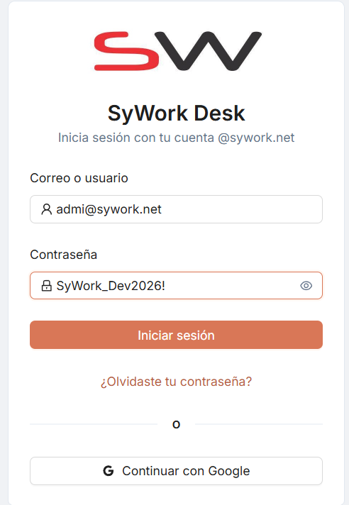
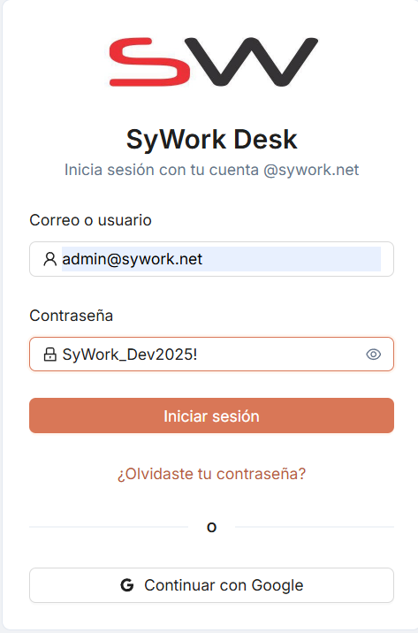

### OBS-0004 — Falta de confirmación al eliminar filtros

- **Módulo/Pantalla:** Tickets
- **Tipo:** Mejora
- **Estado:** Abierta
- **Reportado por:** Arely Pazmiño
- **Iteración de origen:** ITER-002
- **Iteración de cierre:** —

**Descripción**
Al eliminar un filtro, el sistema no solicita confirmación antes de realizar la acción; el filtro se elimina de inmediato.

**Resultado esperado / Situación actual**
Situación actual: el filtro se elimina inmediatamente al presionar la acción de eliminar, sin ningún tipo de confirmación previa.

**Resultado actual / Propuesta de mejora**
Mostrar un mensaje de confirmación antes de eliminar, por ejemplo "¿Desea eliminar el filtro?".

**Criterios de aceptación**
- [ ] Al intentar eliminar un filtro, el sistema muestra un diálogo de confirmación antes de ejecutar la acción.
- [ ] Si el usuario cancela, el filtro no se elimina.

**Evidencia**
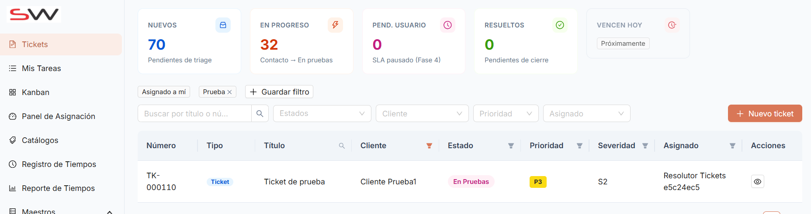

### OBS-0005 — Falta de buscador para seleccionar clientes al crear un proyecto

- **Módulo/Pantalla:** Proyectos > Nuevo Proyecto
- **Tipo:** Mejora
- **Estado:** Abierta
- **Reportado por:** Arely Pazmiño
- **Iteración de origen:** ITER-002
- **Iteración de cierre:** —

**Descripción**
En la opción "Nuevo proyecto", la lista de clientes no cuenta con un buscador, por lo que el usuario debe recorrer manualmente toda la lista para encontrar un cliente.

**Resultado esperado / Situación actual**
Situación actual: la selección de cliente es una lista simple sin capacidad de búsqueda.

**Resultado actual / Propuesta de mejora**
Incorporar un campo de búsqueda en el selector de clientes que permita localizar rápidamente al cliente deseado.

**Criterios de aceptación**
- [ ] El selector de clientes en "Nuevo Proyecto" cuenta con un campo de búsqueda.
- [ ] La búsqueda filtra la lista de clientes en tiempo real conforme se escribe.

**Evidencia**
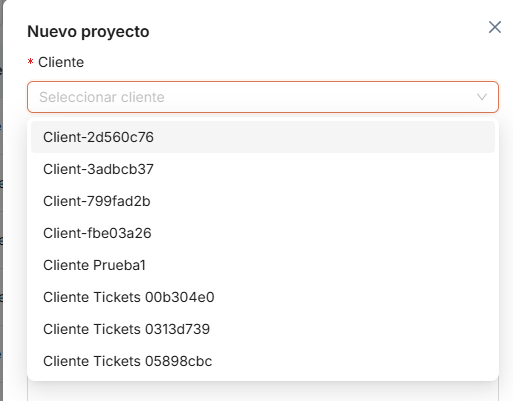

### OBS-0006 — Ausencia de mensaje de confirmación al crear un cliente

- **Módulo/Pantalla:** Clientes > Nuevo Cliente
- **Tipo:** Mejora
- **Estado:** Abierta
- **Reportado por:** Arely Pazmiño
- **Iteración de origen:** ITER-002
- **Iteración de cierre:** —

**Descripción**
Al registrar un cliente correctamente, el sistema no muestra un mensaje de confirmación; el cliente se crea correctamente pero el usuario no recibe ninguna notificación.

**Resultado esperado / Situación actual**
Situación actual: no hay retroalimentación visual de que la creación fue exitosa.

**Resultado actual / Propuesta de mejora**
Mostrar un mensaje de confirmación como "Cliente creado correctamente." al completar la acción.

**Criterios de aceptación**
- [ ] Al crear un cliente exitosamente, el sistema muestra un mensaje de confirmación visible.

**Evidencia**
_Sin evidencia adjunta en la documentación original._

### OBS-0007 — Validación insuficiente en el campo Teléfono

- **Módulo/Pantalla:** Clientes > Nuevo Cliente
- **Tipo:** Defecto
- **Estado:** Abierta
- **Reportado por:** Arely Pazmiño
- **Iteración de origen:** ITER-002
- **Iteración de cierre:** —

**Descripción**
El campo Teléfono permite ingresar letras y no valida una longitud mínima.

**Pasos para reproducir**
1. Ir a Clientes > Nuevo Cliente.
2. En el campo Teléfono, ingresar caracteres alfabéticos y/o un número con menos de 10 dígitos.
3. Guardar el registro.

**Resultado esperado / Situación actual**
Esperado: el sistema debería permitir únicamente números, validar una longitud mínima (por ejemplo, 10 dígitos para Ecuador) y mostrar un mensaje de validación cuando la información ingresada sea incorrecta.
Actual: el sistema acepta caracteres alfabéticos y números con una longitud inferior a la requerida, sin mostrar validación.

**Criterios de aceptación**
- [ ] El campo Teléfono rechaza caracteres no numéricos.
- [ ] El campo Teléfono valida una longitud mínima definida por la regla de negocio.
- [ ] El sistema muestra un mensaje de validación cuando el valor ingresado es incorrecto.

**Evidencia**
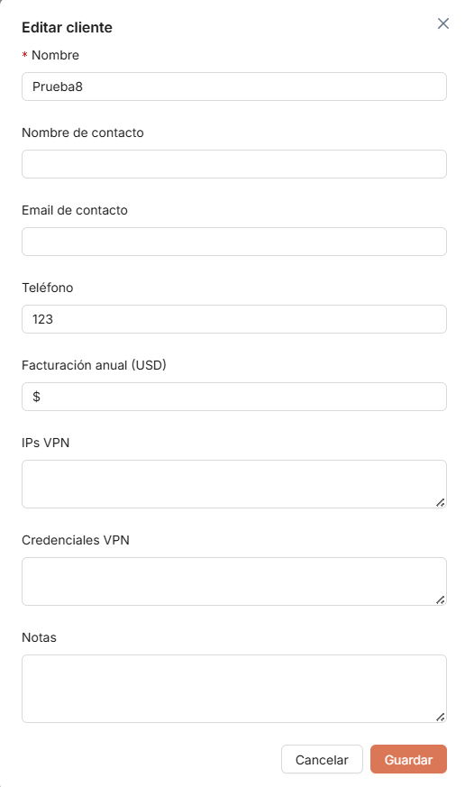
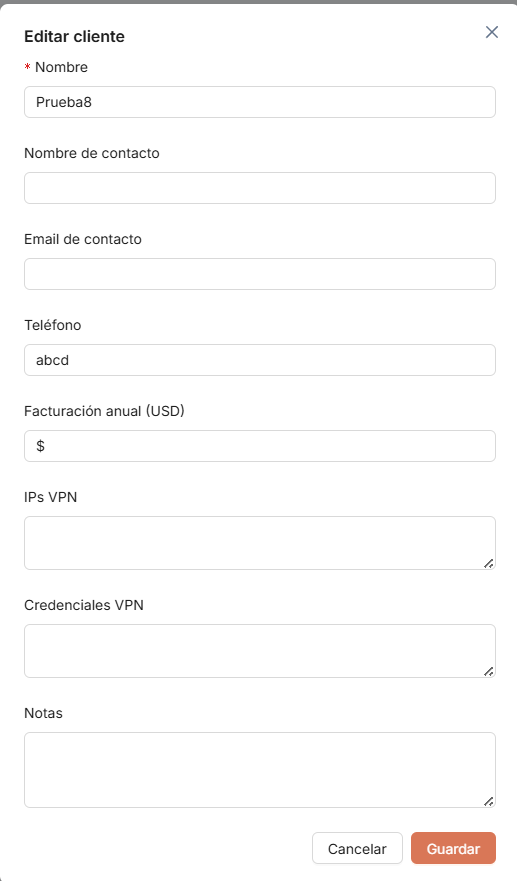

### OBS-0008 — Información compartida entre clientes en los campos VPN

- **Módulo/Pantalla:** Clientes > Editar Cliente
- **Tipo:** Defecto
- **Estado:** Abierta
- **Reportado por:** Arely Pazmiño
- **Iteración de origen:** ITER-002
- **Iteración de cierre:** —

**Descripción**
Los campos "IPs VPN" y "Credenciales VPN" comparten información entre distintos clientes durante la edición.

**Pasos para reproducir**
1. Editar un cliente que tenga datos cargados en "IPs VPN" / "Credenciales VPN".
2. Abrir la edición de otro cliente distinto.
3. Observar los campos "IPs VPN" y "Credenciales VPN".

**Resultado esperado / Situación actual**
Esperado: cada cliente debería visualizar únicamente su propia información de VPN.
Actual: al editar un cliente, se muestran datos pertenecientes a otro cliente.

**Criterios de aceptación**
- [ ] Al abrir la edición de un cliente, los campos "IPs VPN" y "Credenciales VPN" muestran únicamente la información asociada a ese cliente.
- [ ] No se observa información de otro cliente en ningún escenario de edición consecutiva.

**Evidencia**
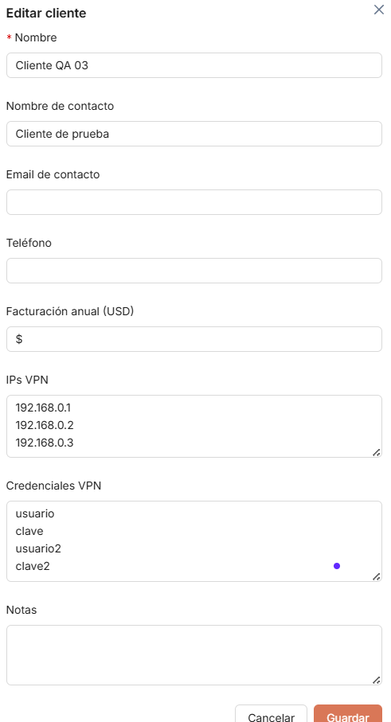
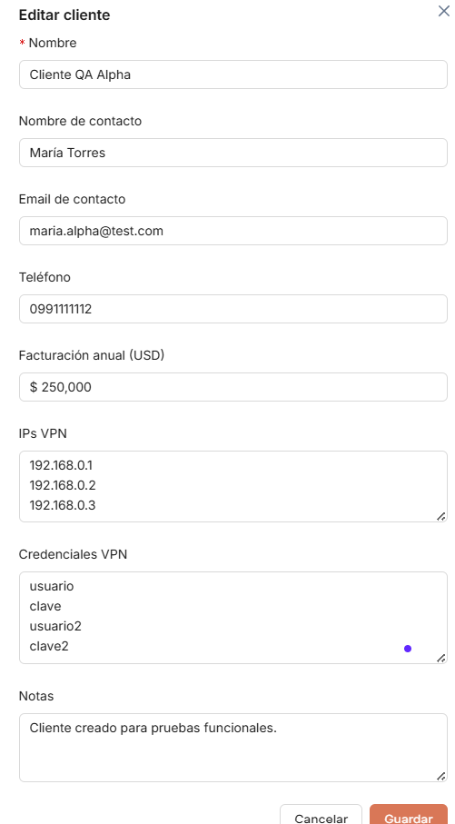
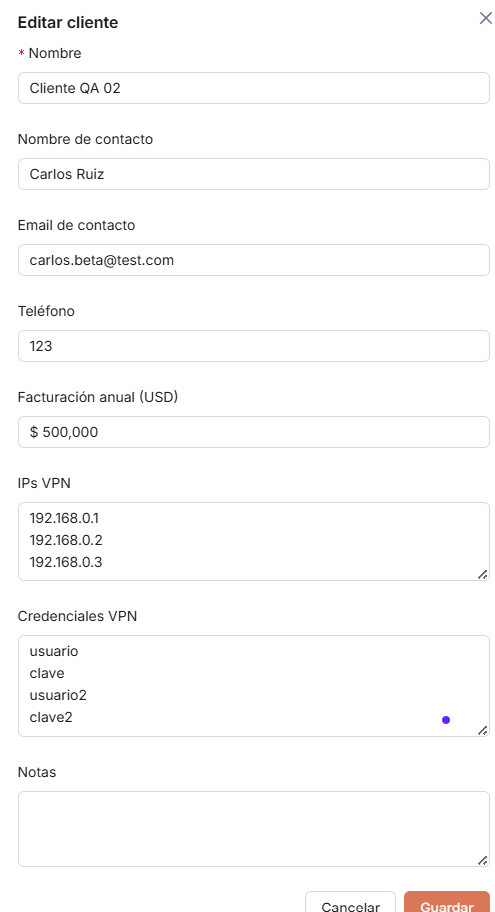
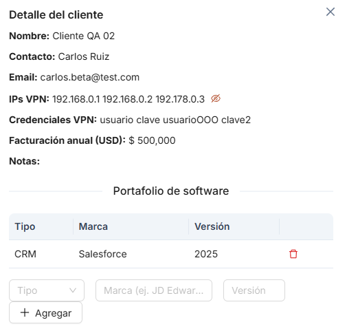

**Nota de relación:** este hallazgo puede estar relacionado con `OBS-0001` (ampliación de los campos VPN a múltiples accesos, ITER-001) — al rediseñar esa sección conviene validar que no se reintroduzca este defecto de aislamiento de datos por cliente.

### OBS-0009 — Ausencia de mensaje de confirmación al crear un proyecto

- **Módulo/Pantalla:** Proyectos > Nuevo Proyecto
- **Tipo:** Mejora
- **Estado:** Abierta
- **Reportado por:** Arely Pazmiño
- **Iteración de origen:** ITER-002
- **Iteración de cierre:** —

**Descripción**
Al crear un proyecto correctamente, el sistema no muestra una notificación de éxito.

**Resultado esperado / Situación actual**
Situación actual: el proyecto se registra correctamente, pero el usuario no recibe confirmación.

**Resultado actual / Propuesta de mejora**
Mostrar un mensaje como "Proyecto creado correctamente." al completar la acción.

**Criterios de aceptación**
- [ ] Al crear un proyecto exitosamente, el sistema muestra un mensaje de confirmación visible.

**Evidencia**
_Sin evidencia adjunta en la documentación original._

### OBS-0010 — Validaciones insuficientes en la creación y edición de proyectos

- **Módulo/Pantalla:** Proyectos > Nuevo/Editar Proyecto
- **Tipo:** Defecto
- **Estado:** Abierta
- **Reportado por:** Arely Pazmiño
- **Iteración de origen:** ITER-002
- **Iteración de cierre:** —

**Descripción**
El formulario de proyecto presenta varias validaciones insuficientes: permite nombres de proyecto excesivamente largos, acepta caracteres especiales (@#$%) y emojis, permite nombres muy largos para las listas de tareas, y permite crear listas con nombres duplicados dentro del mismo proyecto.

**Pasos para reproducir**
1. Crear o editar un proyecto ingresando un nombre excesivamente largo y/o con caracteres especiales o emojis.
2. Dentro del proyecto, crear dos listas de tareas con el mismo nombre.
3. Guardar en cada caso.

**Resultado esperado / Situación actual**
Esperado: el sistema debería definir una longitud máxima para nombres de proyectos y listas, restringir los caracteres permitidos y evitar nombres duplicados de listas dentro de un mismo proyecto.
Actual: el sistema acepta la información sin restricciones en todos los casos descritos.

**Criterios de aceptación**
- [ ] El nombre del proyecto tiene una longitud máxima definida y validada.
- [ ] El nombre del proyecto rechaza caracteres especiales no permitidos y emojis.
- [ ] El nombre de una lista de tareas tiene una longitud máxima definida y validada.
- [ ] No es posible crear dos listas con el mismo nombre dentro de un mismo proyecto.

**Evidencia**
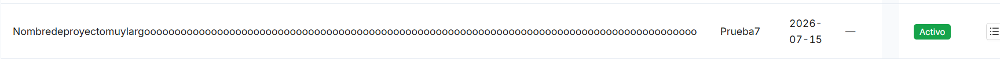
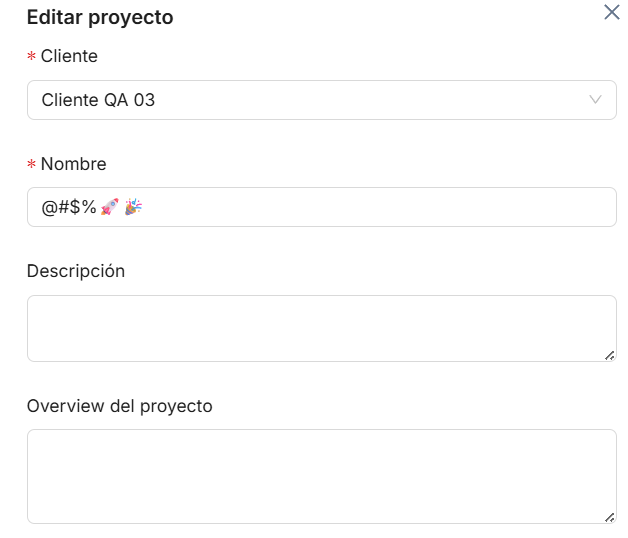
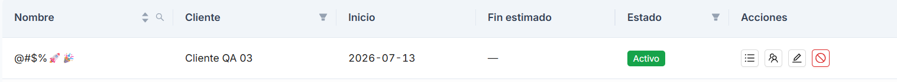
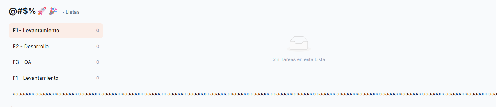
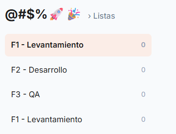

### OBS-0011 — Validación inconsistente de las fechas del proyecto

- **Módulo/Pantalla:** Proyectos > Nuevo/Editar Proyecto
- **Tipo:** Defecto
- **Estado:** Abierta
- **Reportado por:** Arely Pazmiño
- **Iteración de origen:** ITER-002
- **Iteración de cierre:** —

**Descripción**
El sistema presenta inconsistencias en la validación de fechas: permite crear proyectos con fecha de inicio en meses anteriores, y permite que la fecha de inicio y la fecha de fin sean el mismo día.

**Pasos para reproducir**
1. Crear un proyecto con fecha de inicio en un mes anterior al actual.
2. Crear (o editar) un proyecto con fecha de inicio y fecha de fin en el mismo día.

**Resultado esperado / Situación actual**
Esperado: el sistema debería validar que la fecha de inicio cumpla con las reglas de negocio, y que la fecha de fin sea posterior a la fecha de inicio.
Actual: ambos escenarios son aceptados sin validación.

**Criterios de aceptación**
- [ ] El sistema valida la fecha de inicio conforme a la regla de negocio definida (no permite meses anteriores según corresponda).
- [ ] El sistema exige que la fecha de fin sea posterior a la fecha de inicio.

**Evidencia**
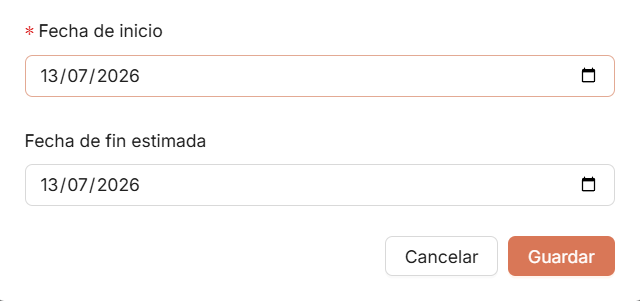
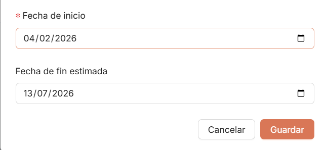

### OBS-0012 — Validación insuficiente en los campos de valores monetarios

- **Módulo/Pantalla:** Proyectos > Nuevo/Editar Proyecto
- **Tipo:** Defecto
- **Estado:** Abierta
- **Reportado por:** Arely Pazmiño
- **Iteración de origen:** ITER-002
- **Iteración de cierre:** —

**Descripción**
Los campos monetarios presentan varios problemas: los valores negativos se reemplazan automáticamente por 0 sin informar al usuario; al ingresar letras, el contenido del campo se elimina sin mostrar mensaje de validación; no se muestran separadores de miles; y si el usuario ingresa un punto como separador de miles (ej. 100.000), el sistema lo interpreta como separador decimal y transforma el valor en 100.

**Pasos para reproducir**
1. En un campo monetario, ingresar un valor negativo y guardar/observar.
2. En un campo monetario, ingresar letras.
3. En un campo monetario, ingresar un valor con punto como separador de miles (ej. "100.000").

**Resultado esperado / Situación actual**
Esperado: el sistema debería mostrar un mensaje cuando se ingresen valores negativos, mostrar mensajes de validación para caracteres no permitidos, aplicar formato monetario con separadores de miles, e interpretar correctamente los formatos numéricos definidos por la aplicación (ej. 10,000.00 / 120,500.50).
Actual: el sistema modifica o elimina los valores ingresados sin informar al usuario y no aplica un formato monetario adecuado.

**Criterios de aceptación**
- [ ] Al ingresar un valor negativo en un campo monetario, el sistema muestra un mensaje de validación (no lo reemplaza silenciosamente por 0).
- [ ] Al ingresar caracteres no numéricos, el sistema muestra un mensaje de validación (no borra el contenido silenciosamente).
- [ ] Los campos monetarios muestran separadores de miles.
- [ ] El sistema interpreta correctamente el formato numérico definido (ej. 10,000.00 como diez mil, no como diez).

**Evidencia**
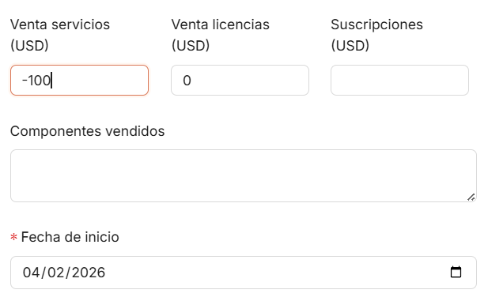
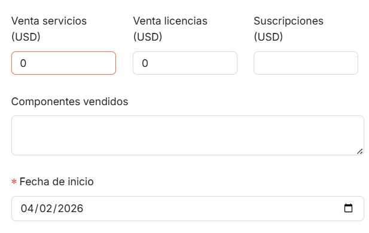
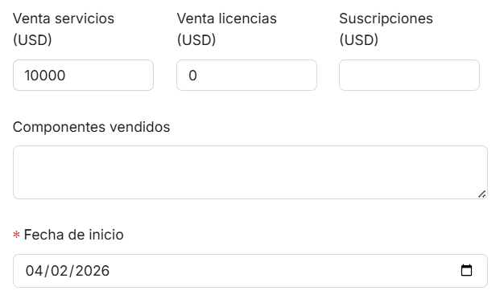
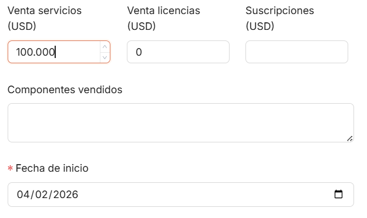
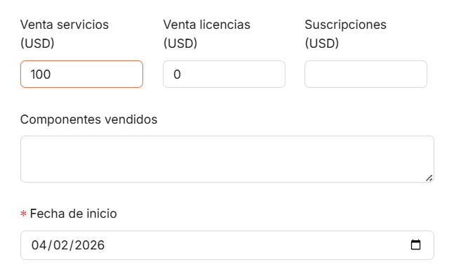
