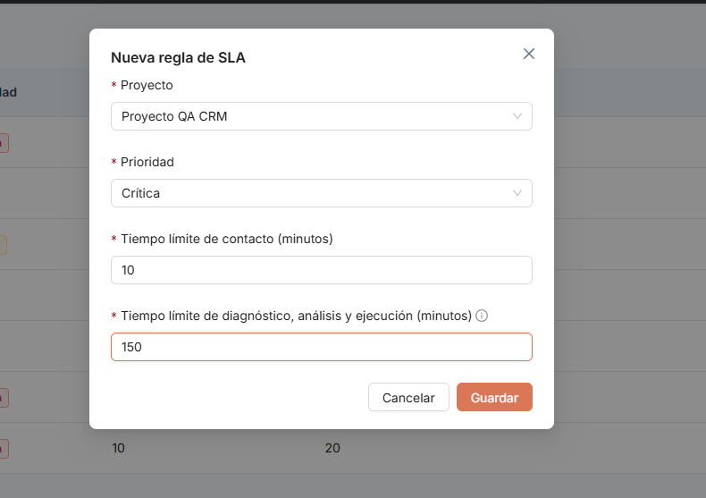
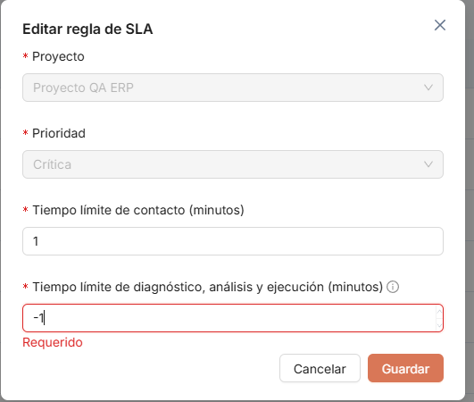
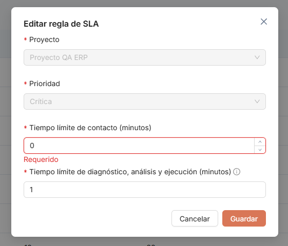
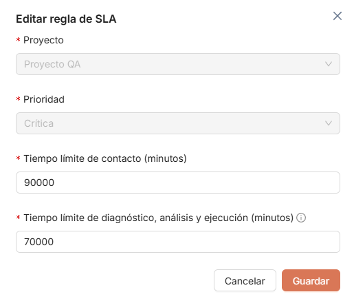
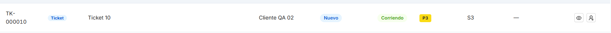
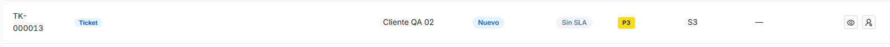
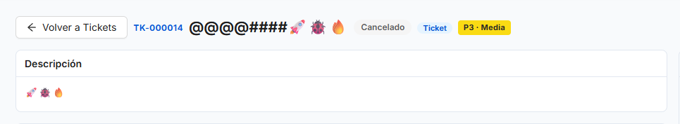
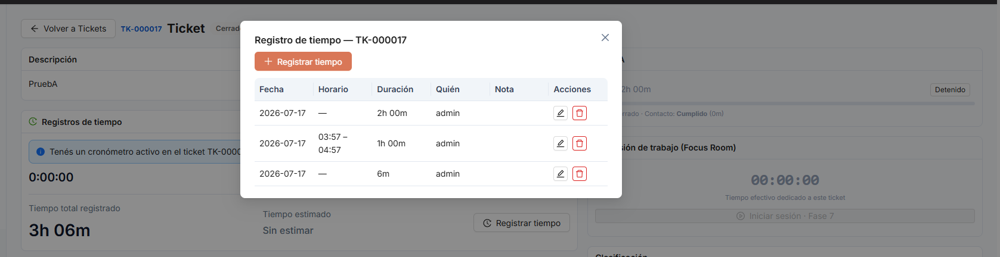

# ITER-004 — Iteración de pruebas

## Objetivo de la iteración

Incorporación al framework UAT de la documentación de errores recopilada por Arely Pazmiño en dos archivos complementarios de `docs/Documentacion_Errores_Arely/`:

- `DocumentacionErrores2.docx` (hallazgos EA11–EA17, 7 hallazgos, con evidencia gráfica embebida — imágenes extraídas y renombradas a la convención `OBS-XXXX-NN.png` en `images/`).
- `DocumentoErrores3.md` (hallazgos EA-018–EA-0020, 3 hallazgos, sin evidencia gráfica adjunta).

Ambos documentos ya declaraban internamente `Iteración de origen: ITER-004`, por lo que se incorporan juntos como una sola iteración. Cubren SLA Configurable (mensajes de confirmación, límites mínimos/máximos de tiempo, estado inicial visual), creación de Tickets (validación de título) y registro de tiempos (cierre de ticket, horario laboral, visibilidad del calendario del recurso).

> Nota: el documento original no especifica versión de la app probada ni entorno.

**Nota de mapeo de tipos**: los documentos fuente usan una taxonomía de tres tipos (`Bug`, `Mejora`, `Observación`) mientras que el framework UAT define solo dos (`Defecto`, `Mejora`, ver `CONVENTIONS.md`). Se mapeó `Bug` → `Defecto` y `Observación` → `Mejora` (son hallazgos donde la funcionalidad se comporta como fue construida, pero se propone una regla de negocio o cambio a definir con producto).

**Nota de deduplicación**: `EA17` (`DocumentacionErrores2.docx` — "Se permite registrar tiempo en un ticket que ya se encuentra cerrado") y `EA-018` (`DocumentoErrores3.md` — "El registro de tiempo continúa disponible después de cerrar el ticket") describen el mismo defecto sobre el mismo módulo (Tickets > Detalle del Ticket > Registro de tiempos): el cronómetro/registro de tiempo no se deshabilita cuando el ticket pasa a Cerrado. Por convención (no duplicar IDs para el mismo síntoma), se registran como una única observación, `OBS-0035`, combinando los criterios de aceptación de ambos (incluye el matiz de `EA-018` sobre detener automáticamente un cronómetro ya activo y preservar el tiempo ya registrado).

## Resumen de observaciones

| ID | Módulo/Pantalla | Tipo | Estado | Reportado por |
|---|---|---|---|---|
| OBS-0029 | SLA Configurable | Defecto | Abierta | Arely Pazmiño |
| OBS-0030 | SLA Configurable | Defecto | Abierta | Arely Pazmiño |
| OBS-0031 | SLA Configurable | Mejora | Abierta | Arely Pazmiño |
| OBS-0032 | Tickets > Detalle del Ticket | Mejora | Abierta | Arely Pazmiño |
| OBS-0033 | Tickets > Nuevo Ticket | Defecto | Abierta | Arely Pazmiño |
| OBS-0034 | Tickets > Nuevo Ticket | Mejora | Abierta | Arely Pazmiño |
| OBS-0035 | Tickets > Detalle del Ticket > Registro de tiempos | Defecto | Abierta | Arely Pazmiño |
| OBS-0036 | Tickets > Registro de tiempos | Mejora | Abierta | Arely Pazmiño |
| OBS-0037 | Equipo > Perfil del recurso / Calendario | Mejora | Abierta | Arely Pazmiño |

## Detalle de observaciones

### OBS-0029 — Falta de mensaje de confirmación al crear una configuración SLA

- **Módulo/Pantalla:** SLA Configurable
- **Tipo:** Defecto
- **Estado:** Abierta
- **Reportado por:** Arely Pazmiño
- **Iteración de origen:** ITER-004
- **Iteración de cierre:** —

**Descripción**
Al crear una nueva configuración de SLA, el sistema guarda correctamente la información, pero no muestra ningún mensaje de confirmación indicando que el registro fue creado exitosamente.

**Pasos para reproducir**
1. Ir a Maestros/SLA Configurable → Nueva configuración de SLA.
2. Completar los campos requeridos y guardar.
3. Observar que no aparece ninguna notificación de éxito.

**Resultado esperado / Situación actual**
Esperado: al guardar exitosamente, el sistema debería mostrar una notificación (Toast o Alert) confirmando la operación, por ejemplo "Configuración SLA creada correctamente."
Actual: la configuración se guarda correctamente, pero el usuario no recibe ninguna confirmación visual de que la operación fue exitosa.

**Criterios de aceptación**
- [ ] Al guardar una configuración SLA correctamente, el sistema muestra un mensaje de confirmación.
- [ ] La notificación desaparece automáticamente después de unos segundos o puede cerrarse manualmente.

**Evidencia**

### OBS-0030 — Los tiempos mínimos de SLA se modifican automáticamente sin informar al usuario

- **Módulo/Pantalla:** SLA Configurable
- **Tipo:** Defecto
- **Estado:** Abierta
- **Reportado por:** Arely Pazmiño
- **Iteración de origen:** ITER-004
- **Iteración de cierre:** —

**Descripción**
Al ingresar el valor 0 o un número negativo en los campos de tiempo del SLA (Tiempo límite de contacto, diagnóstico, análisis y ejecución), el sistema reemplaza automáticamente el valor por 1 minuto, sin mostrar ninguna validación o mensaje al usuario.

**Pasos para reproducir**
1. Ir a SLA Configurable → Nueva/Editar configuración.
2. En cualquiera de los campos de tiempo (contacto, diagnóstico, análisis, ejecución), ingresar `0` o un valor negativo.
3. Guardar u observar el campo: el valor se reemplaza silenciosamente por `1`.

**Resultado esperado / Situación actual**
Esperado: si el valor mínimo permitido es 1 minuto, el sistema debería impedir el ingreso de valores menores y mostrar un mensaje de validación, por ejemplo "El tiempo mínimo permitido es de 1 minuto."
Actual: el sistema cambia automáticamente el valor ingresado a 1, sin informar al usuario la razón del cambio.

**Criterios de aceptación**
- [ ] El sistema valida el valor ingresado antes de guardar.
- [ ] Si el usuario ingresa un valor menor al permitido, se muestra un mensaje indicando el motivo.
- [ ] El sistema no modifica automáticamente el dato sin notificar al usuario.

**Evidencia**

### OBS-0031 — No existe una longitud máxima para los tiempos configurables del SLA

- **Módulo/Pantalla:** SLA Configurable
- **Tipo:** Mejora
- **Estado:** Abierta
- **Reportado por:** Arely Pazmiño
- **Iteración de origen:** ITER-004
- **Iteración de cierre:** —

**Descripción**
El sistema permite ingresar tiempos muy elevados en los campos del SLA sin ninguna restricción.

**Resultado esperado / Situación actual**
Situación actual: es posible registrar tiempos excesivamente grandes en los campos de tiempo del SLA, lo que podría generar configuraciones poco realistas.

**Resultado actual / Propuesta de mejora**
Definir un límite máximo de tiempo permitido para los campos de tiempo del SLA, o validar el rango de acuerdo con las políticas de la empresa.

**Criterios de aceptación**
- [ ] El sistema valida un tiempo máximo permitido en los campos de tiempo del SLA.
- [ ] Si el usuario supera ese límite, se muestra un mensaje de validación.

**Evidencia**

### OBS-0032 — Mejorar la visualización del estado inicial del SLA

- **Módulo/Pantalla:** Tickets > Detalle del Ticket
- **Tipo:** Mejora
- **Estado:** Abierta
- **Reportado por:** Arely Pazmiño
- **Iteración de origen:** ITER-004
- **Iteración de cierre:** —

**Descripción**
Al crear un ticket, el componente del SLA se muestra desde el inicio con la fase "Contacto", lo que puede dar la impresión de que el contador ya está en ejecución, aunque realmente aún no esté contabilizando tiempo.

**Resultado esperado / Situación actual**
Situación actual: el usuario puede interpretar que el SLA ya está corriendo desde la creación del ticket, cuando en realidad el conteo todavía no inició.

**Resultado actual / Propuesta de mejora**
Mostrar un estado más descriptivo antes del inicio del conteo, por ejemplo "Pendiente de asignación", "Esperando inicio de SLA" o "Contacto (pendiente de iniciar)", o incluir un indicador visual que diferencie claramente un SLA activo de uno pendiente.

**Criterios de aceptación**
- [ ] Antes de que el SLA comience a contabilizar tiempo, el sistema muestra un estado que indique claramente que aún no está en ejecución.
- [ ] El usuario puede identificar fácilmente cuándo el contador está activo y cuándo solo está preparado para iniciar.

**Evidencia**

### OBS-0033 — El título del ticket permite ingresar solo espacios en blanco

- **Módulo/Pantalla:** Tickets > Nuevo Ticket
- **Tipo:** Defecto
- **Estado:** Abierta
- **Reportado por:** Arely Pazmiño
- **Iteración de origen:** ITER-004
- **Iteración de cierre:** —

**Descripción**
Al crear un ticket, el sistema permite ingresar un título compuesto únicamente por espacios en blanco y guardar el registro.

**Pasos para reproducir**
1. Ir a Tickets → Nuevo Ticket.
2. En el campo Título, ingresar únicamente espacios en blanco.
3. Guardar el ticket.

**Resultado esperado / Situación actual**
Esperado: el sistema debería recortar (`trim`) los espacios al inicio y al final, y verificar que exista texto real antes de permitir guardar el ticket.
Actual: el sistema acepta títulos vacíos formados solo por espacios.

**Criterios de aceptación**
- [ ] El sistema no permite guardar un ticket cuyo título contenga únicamente espacios.
- [ ] Se muestra un mensaje indicando que el título es obligatorio.

**Evidencia**

### OBS-0034 — Revisar validación de caracteres permitidos en el título del ticket

- **Módulo/Pantalla:** Tickets > Nuevo Ticket
- **Tipo:** Mejora
- **Estado:** Abierta
- **Reportado por:** Arely Pazmiño
- **Iteración de origen:** ITER-004
- **Iteración de cierre:** —

**Descripción**
Se observó que el título del ticket permite ingresar caracteres especiales y emojis sin restricción.

**Resultado esperado / Situación actual**
Situación actual: el sistema acepta caracteres especiales y emojis en el título del ticket sin ninguna restricción.

**Resultado actual / Propuesta de mejora**
Validar con el Product Owner si estos caracteres deben estar permitidos. En caso contrario, implementar una validación que restrinja los caracteres aceptados de acuerdo con las reglas de negocio.

**Criterios de aceptación**
- [ ] Definir los caracteres permitidos para el título del ticket.
- [ ] Validar la entrada conforme a la política establecida por el negocio.

**Evidencia**

### OBS-0035 — El registro de tiempo continúa disponible/activo después de cerrar el ticket

- **Módulo/Pantalla:** Tickets > Detalle del Ticket > Registro de tiempos
- **Tipo:** Defecto
- **Estado:** Abierta
- **Reportado por:** Arely Pazmiño
- **Iteración de origen:** ITER-004
- **Iteración de cierre:** —

**Descripción**
Una vez que un ticket cambia al estado Cerrado, el sistema continúa permitiendo iniciar el cronómetro y registrar nuevas horas de trabajo sobre ese ticket. Adicionalmente, si el cronómetro ya se encontraba activo en el momento del cierre, el sistema no lo detiene automáticamente, por lo que sigue contabilizando tiempo sobre un ticket ya finalizado.

*(Consolida `EA17` de `DocumentacionErrores2.docx` y `EA-018` de `DocumentoErrores3.md`, ambos reportados por Arely Pazmiño sobre el mismo síntoma.)*

**Pasos para reproducir**
1. Iniciar el cronómetro de registro de tiempo en un ticket activo.
2. Cambiar el ticket al estado Cerrado sin detener el cronómetro manualmente.
3. Observar que el cronómetro sigue activo y que además es posible iniciar un nuevo registro de tiempo sobre el mismo ticket ya cerrado.

**Resultado esperado / Situación actual**
Esperado: al cerrar un ticket, el sistema debería detener automáticamente cualquier registro de tiempo activo y deshabilitar la posibilidad de iniciar nuevos registros, permitiendo al recurso continuar registrando tiempo en otros tickets o tareas activos.
Actual: el sistema permite seguir registrando tiempos (nuevos o ya en curso) en tickets cerrados.

**Criterios de aceptación**
- [ ] Al cambiar un ticket al estado Cerrado, cualquier cronómetro activo debe detenerse automáticamente.
- [ ] El sistema no debe permitir iniciar un nuevo registro de tiempo en un ticket cerrado.
- [ ] El tiempo registrado antes del cierre debe conservarse correctamente.
- [ ] El usuario debe poder iniciar el registro de tiempo en otro ticket activo sin verse afectado por el cierre de este.
- [ ] El sistema informa al usuario que el ticket ya fue finalizado y no admite nuevos registros de tiempo.

**Evidencia**

### OBS-0036 — El registro de tiempo permite registrar actividad fuera del horario laboral del calendario

- **Módulo/Pantalla:** Tickets > Registro de tiempos
- **Tipo:** Mejora
- **Estado:** Abierta
- **Reportado por:** Arely Pazmiño
- **Iteración de origen:** ITER-004
- **Iteración de cierre:** —

**Descripción**
Se verificó que el sistema permite continuar registrando tiempo fuera del horario laboral configurado en el calendario. Durante la prueba, el registro se realizó aproximadamente a las 23:02 y el SLA se encontraba pausado. Adicionalmente, el registro aparece asociado a la fecha siguiente, posiblemente debido a la hora en la que se realizó la actividad.

**Resultado esperado / Situación actual**
Situación actual: el sistema permite registrar tiempo fuera del horario laboral configurado y se debe verificar si la fecha asignada al registro corresponde correctamente a la fecha y hora real de inicio de la actividad.

**Resultado actual / Propuesta de mejora**
Definir la regla de negocio para el registro de tiempo fuera del horario laboral. Podrían considerarse las siguientes alternativas:
1. Permitir el registro fuera de horario, pero mostrar una advertencia al usuario.
2. Permitirlo y clasificarlo como tiempo fuera de jornada laboral.
3. Bloquearlo, salvo que exista una autorización especial.
4. Permitirlo, pero mantener correctamente la fecha real en la que inició el trabajo.

**Criterios de aceptación**
- [ ] Definir si se permite registrar tiempo fuera del horario laboral.
- [ ] El sistema debe conservar correctamente la fecha y hora real de inicio y finalización.
- [ ] El registro debe diferenciar, si corresponde, entre tiempo laboral y tiempo fuera de jornada.
- [ ] El comportamiento debe ser consistente con la configuración del SLA y del calendario.

**Evidencia**
_Sin evidencia adjunta en la documentación original._

### OBS-0037 — El calendario del recurso no muestra la configuración de jornada laboral

- **Módulo/Pantalla:** Equipo > Perfil del recurso / Calendario
- **Tipo:** Mejora
- **Estado:** Abierta
- **Reportado por:** Arely Pazmiño
- **Iteración de origen:** ITER-004
- **Iteración de cierre:** —

**Descripción**
Se verificó que el calendario configurado para los clientes permite visualizar la información correspondiente a los días y horarios laborales. Sin embargo, al consultar el calendario de un recurso interno (ej. `@sywork.net`), no se muestra información relacionada con su jornada laboral o disponibilidad — actualmente el calendario del recurso únicamente muestra información como su cumpleaños.

**Resultado esperado / Situación actual**
Situación actual: el calendario del recurso no muestra claramente sus días laborales, horarios de trabajo, feriados aplicables, ausencias o disponibilidad. Solo se visualiza información personal como el cumpleaños.

**Resultado actual / Propuesta de mejora**
El calendario del recurso debería mostrar la información relevante para la planificación y asignación de trabajo, incluyendo: calendario base asignado, país del calendario, días laborales, horario de trabajo, feriados aplicables, vacaciones, ausencias, permisos, excepciones de calendario, y horas disponibles/ocupadas. Esto es especialmente importante porque el Panel de Asignación debe utilizar la disponibilidad real de los recursos para asignar tickets y tareas.

**Criterios de aceptación**
- [ ] El sistema muestra el calendario laboral asignado al recurso.
- [ ] Se visualizan correctamente los días y horarios laborales.
- [ ] Se muestran los feriados correspondientes al calendario asignado.
- [ ] Se pueden identificar ausencias y excepciones.
- [ ] La disponibilidad del recurso puede ser utilizada por el Panel de Asignación.
- [ ] La información del calendario del recurso se encuentra separada de eventos personales como cumpleaños.

**Evidencia**
_Sin evidencia adjunta en la documentación original._
