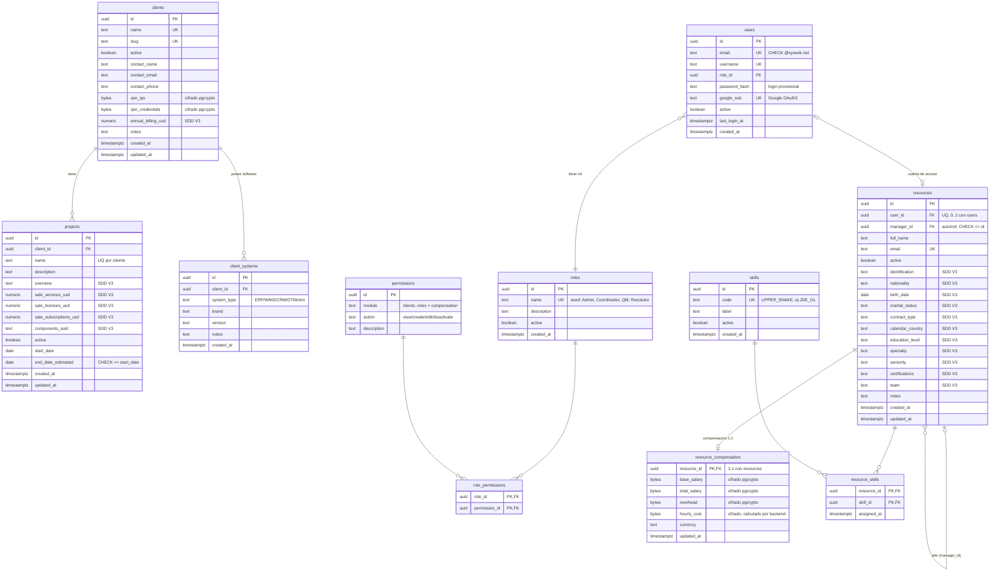
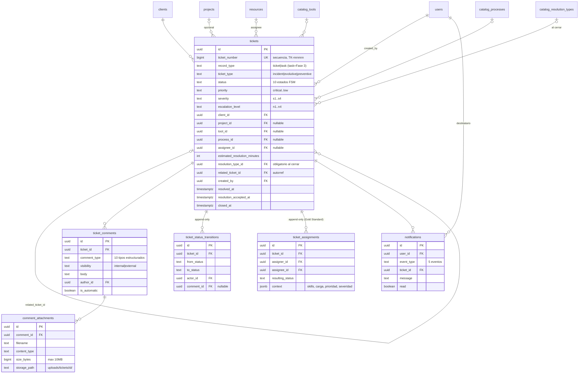

# MER — Modelo Entidad-Relación (Fase 0 Maestros + Ampliación SDD V3)

**Generado**: 2026-07-02, extraído del esquema real de PostgreSQL (`information_schema`).
**Migración vigente**: `010_extend_masters_sdd_v3.py` (head).

## Reglas de negocio ancladas al modelo

- `clients` es el **RLS root**: las políticas de Row Level Security parten de aquí (extensible
  a tickets en Fase 1).
- `projects.name` es único **por cliente**, no globalmente (`UNIQUE (client_id, name)`).
- `users.role_id` es NOT NULL: exactamente un rol por usuario; regla del "último Admin"
  aplicada en dominio.
- `resources.manager_id` tiene `CHECK (manager_id IS NULL OR manager_id <> id)`; el dominio
  exige además que el jefe sea un recurso activo.
- `resource_compensation` es accesible solo con permiso `compensation:view/edit`
  (sembrado únicamente para Admin); el endpoint es la única ruta de maestros con
  enforcement JWT en esta fase (FR-033). `hourly_cost` lo calcula el backend:
  `(total_salary + overhead) / 240 h/mes`.
- Campos `bytea` = cifrados en reposo (pgcrypto; implementación dev es placeholder,
  reemplazar por `pgp_sym_encrypt` en producción).
- Un `skill` no puede eliminarse si está asignado a algún recurso; un `permission` no puede
  eliminarse si está asignado a algún rol.

---

# Ampliación Fase 1 — Tickets (2026-07-02, migraciones 011-012)

**Reglas Fase 1**: estado solo cambia vía FSM (`domain/fsm/ticket_fsm.py`, python-transitions,
16 transiciones); `ticket_status_transitions` y `ticket_assignments` son append-only;
RLS habilitado en todas las tablas de tickets (migración 012); permisos: módulos `tickets`
(6 acciones), `assignment_panel`, `catalogs`; enforcement JWT+permiso activo en TODA la API.
