# Manual de Usuario — SyWork Tickets

**Versión del manual**: 3.2 (todas las capturas de pantalla son reales, incluida la vista Usuario/cliente)
**Fecha**: 2026-07-21
**Alcance cubierto**: Fases 0 a 5 SDD V3 (specs 001 a 024) — Maestros completo, Tickets/Tareas,
Registro de Tiempos, SLA por Proyecto/Prioridad, Calendarios/RRHH y disponibilidad, Historial visual
de SLA y Reasignación de resolutores con sugerencias de carga/disponibilidad.
**Verificación**: todo el contenido de este manual fue contrastado navegando la aplicación real en
el entorno de desarrollo (Docker), no solo leyendo el código — ver sección 8 para el detalle, y la
sección 8.1 para cómo se generaron las capturas de pantalla reales.

---

## Cómo usar este manual

- Está escrito para quien **usa** el sistema día a día (Administrador, Coordinador, QM, Resolutor,
  RRHH, Usuario/cliente), no para quien lo programa. No vas a encontrar nombres de archivos, tablas
  de base de datos ni código.
- **Todas** las pantallas incluyen una **captura real**, tomada automáticamente de la aplicación en
  el entorno de desarrollo con el script `scripts/manual-screenshots/capture.js` (Node.js +
  Puppeteer). El pie de cada imagen explica qué se ve y qué hace cada botón/campo relevante.
- Los bloques 💡 **Nota** y ⚠️ **Advertencia** resuelven las dudas y errores más comunes sin que
  tengas que leer el manual completo — puedes ir directo a ellos con `Ctrl+F`.
- Los diagramas están en formato **Mermaid** (bloques ` ```mermaid `). Se ven como diagrama en
  GitHub, VS Code o cualquier visor con soporte Mermaid, y el texto de cada diagrama puede
  reutilizarse o editarse sin herramientas especiales.
- Este documento es la fuente única desde la que se genera `docs/Manual_de_Usuario.docx` para
  distribución en Word/PDF.

---

## 1. Resumen Arquitectónico (orientado a usabilidad)

SyWork Tickets organiza el trabajo en **cinco niveles**, de lo más general a lo más específico:

```
Cliente  →  Proyecto  →  Lista de Tareas  →  Ticket/Tarea  →  Subtarea
```

En la práctica, esto se traduce en cinco módulos que se alimentan entre sí:

| Módulo | Qué resuelve | A quién alimenta |
|--------|--------------|-------------------|
| **Proyectos** (y sus Maestros: Clientes, Equipo, Skills) | Define quién es el cliente, qué proyecto se atiende y qué personas/skills están disponibles para trabajarlo | A Tickets (de dónde sale un ticket) y a RRHH (quién pertenece a qué equipo) |
| **Tickets/Tareas** | El trabajo en sí: incidentes, evolutivos y preventivos, con su ciclo de vida (Nuevo → … → Cerrado) | A Registro de Tiempo (cada sesión de trabajo se asocia a un ticket) y a SLA (cada estado tiene un tiempo límite) |
| **Calendarios / RRHH** | Horario laboral por país/recurso, festivos y ausencias (vacaciones/permisos) | A la Asignación y Reasignación de tickets (de aquí sale la etiqueta "no disponible") y al motor de SLA (de aquí sale cuándo el contador corre o se pausa) |
| **Registro de Tiempo** | Cuánto tiempo real se dedicó a cada ticket/tarea | A los reportes de carga de trabajo que se usan para sugerir a quién asignar o reasignar |
| **SLA** | El tiempo límite que tiene cada fase del ticket, según proyecto y prioridad | Se apoya en Calendarios/RRHH para saber cuándo "cuenta" el tiempo, y se refleja en el Historial de estados del ticket |

En una frase: **Proyectos define el "para quién" y "con quién"; Tickets define el "qué"; Calendarios/RRHH
define el "cuándo está disponible cada quién"; y SLA vigila que todo eso se resuelva a tiempo.** El
Registro de Tiempo es el hilo que conecta el trabajo real con esos tres.

> 💡 **Nota**: no necesitas entender esta arquitectura para usar el sistema — pero te ayuda a saber
> **dónde buscar** cuando algo no aparece como esperas. Por ejemplo, si un resolutor no aparece
> disponible al asignar un ticket, la causa está en Calendarios/RRHH, no en el módulo de Tickets.

### 1.1 Roles y qué puede hacer cada uno (ayuda rápida)

Los roles se administran en **Maestros → Roles y Permisos**, donde cada uno tiene un conjunto de
permisos por módulo. Verificado en un entorno real, estos son los roles configurados hoy:

| Rol | Qué hace principalmente | Pantallas que más usa |
|-----|--------------------------|------------------------|
| **Admin** | Acceso total: configura todos los Maestros y administra Roles y Permisos | Todas |
| **Coordinador** | Crea y asigna tickets (Triage Push), decide reasignaciones, supervisa el Panel de Asignación | Tickets, Kanban, Panel de Asignación, Detalle de Ticket |
| **QM** | Recibe tickets en Pre-Análisis y decide su encaminamiento | Kanban, Mis Tareas |
| **Resolutor** | Atiende, documenta y resuelve tickets/tareas asignados; registra su tiempo | Mis Tareas, Detalle de Ticket, Registro de Tiempos |
| **RRHH** | Aprueba/rechaza solicitudes de ausencia del equipo; administra franjas horarias y calendario | Calendario, Permisos, Franjas Horarias |
| **Usuario/cliente** | Usuario externo de un Cliente: solo crea y ve sus propios tickets | Tickets (vista restringida) |

Además de estos roles, existe el concepto de **Jefe directo**: no es un rol de Roles y Permisos, sino
una relación entre recursos (cada recurso puede tener un jefe asignado en Maestros → Equipo). Quien
figure como jefe directo de un recurso aprueba sus solicitudes de ausencia, sin importar su rol.

> 💡 **Nota — verificado en vivo**: en el entorno de desarrollo, el rol **RRHH** está descrito
> textualmente en el sistema como *"Recursos Humanos: aprueba/rechaza solicitudes de ausencia del
> equipo"*, y **Usuario/cliente** como *"Usuario externo de un Cliente: solo crea y ve sus propios
> tickets"* — son las descripciones que verás tal cual en Roles y Permisos.

> ⚠️ **Advertencia — "No veo la opción X"**: casi siempre es un tema de permisos, no un error. El
> menú lateral y los botones de acción se muestran u ocultan según el rol conectado. Si crees que
> deberías tener acceso a algo que no ves, consulta con quien administra **Roles y Permisos**.

---

## 2. Diagramas de Flujo y Procesos

### 2.1 Ciclo de vida de un Ticket

Un Ticket nace en estado **Nuevo** y avanza por una serie de estados fijos. El cambio de estado no
se hace escribiendo texto libre: se dispara con **comentarios de tipo estructurado** (por ejemplo
"Confirmación de atención" o "Solicitud de cierre"), lo que garantiza que el historial quede siempre
consistente y auditable.

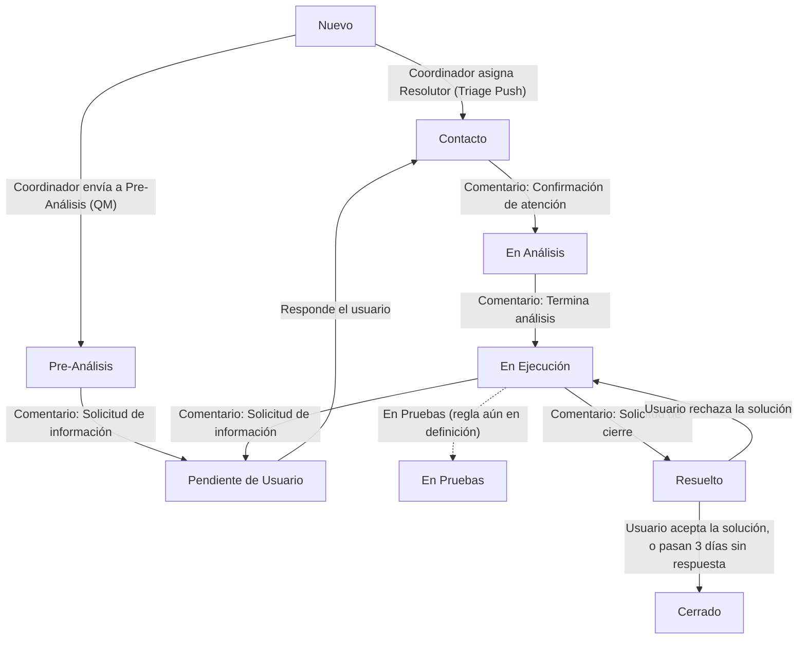
```mermaid
flowchart TD
    NUEVO["Nuevo"] -->|"Coordinador asigna Resolutor (Triage Push)"| CONTACTO["Contacto"]
    NUEVO -->|"Coordinador envía a Pre-Análisis (QM)"| PREANALISIS["Pre-Análisis"]
    PREANALISIS -->|"Comentario: Solicitud de información"| PENDIENTE["Pendiente de Usuario"]
    PENDIENTE -->|"Responde el usuario"| CONTACTO
    CONTACTO -->|"Comentario: Confirmación de atención"| ANALISIS["En Análisis"]
    ANALISIS -->|"Comentario: Termina análisis"| EJECUCION["En Ejecución"]
    EJECUCION -->|"Comentario: Solicitud de información"| PENDIENTE
    EJECUCION -.->|"En Pruebas (regla aún en definición)"| PRUEBAS["En Pruebas"]
    EJECUCION -->|"Comentario: Solicitud de cierre"| RESUELTO["Resuelto"]
    RESUELTO -->|"Usuario acepta la solución, o pasan 3 días sin respuesta"| CERRADO["Cerrado"]
    RESUELTO -->|"Usuario rechaza la solución"| EJECUCION
```

**Cómo leer este diagrama en la práctica**:

1. Un ticket nuevo llega al Coordinador, quien decide si va directo a un **Resolutor** (estado
   Contacto) o si necesita pasar primero por **Pre-Análisis** con un QM.
2. Cuando el Resolutor confirma que empieza a trabajar el caso ("Confirmación de atención"), el
   ticket pasa a **En Análisis**; cuando termina de entender el problema ("Termina análisis"), pasa
   a **En Ejecución**.
3. Si en cualquier punto se necesita más información del usuario, el ticket pasa a **Pendiente de
   Usuario** — y ahí, además de esperar respuesta, **el contador de SLA se pausa** (ver sección 2.3).
4. Cuando el Resolutor entrega la solución ("Solicitud de cierre"), el ticket pasa a **Resuelto**. Si
   el usuario acepta (o no responde en 3 días), pasa a **Cerrado**; si el usuario rechaza la
   solución, vuelve a **En Ejecución**.
5. El estado **En Pruebas** existe en el catálogo del sistema, pero su regla de disparo todavía está
   en definición — si lo ves en una pantalla, trátalo como informativo, no como parte del flujo
   garantizado. En el Detalle de Ticket vas a ver un botón **"Pasar a pruebas"** disponible desde
   varios estados, junto a **"Cancelar ticket"**.

> 💡 **Nota**: el ticket también puede quedar en estado **Cancelado** cuando ya no procede
> atenderlo. Este manual no detalla el disparador exacto de cancelación porque, a diferencia de los
> estados anteriores, no forma parte del flujo principal de atención.

> 💡 **Ejemplo real verificado**: el ticket `TK-000004` ("pribando") muestra en su Historial de
> estados la secuencia real `Nuevo → Contacto → En Análisis → Pendiente de Usuario → En Ejecución`,
> disparada por los comentarios "Asignado" (automático), "Confirmación de atención", "Solicitud de
> información" y "Respuesta de usuario", en ese orden — exactamente como describe este diagrama.

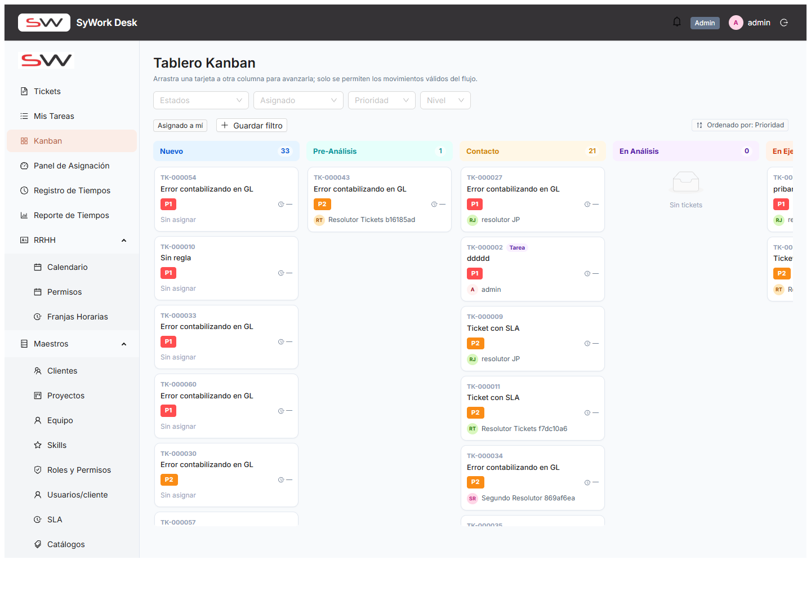

### 2.2 Solicitud y aprobación de Vacaciones / Permisos (RRHH)

La aprobación de una ausencia (vacaciones o permiso) requiere **dos visto buenos independientes**:
el del **Jefe directo** del recurso y el de **RRHH**. No es necesario que uno espere al otro — cada
uno decide desde su propia bandeja — pero el resultado final combina ambas respuestas:

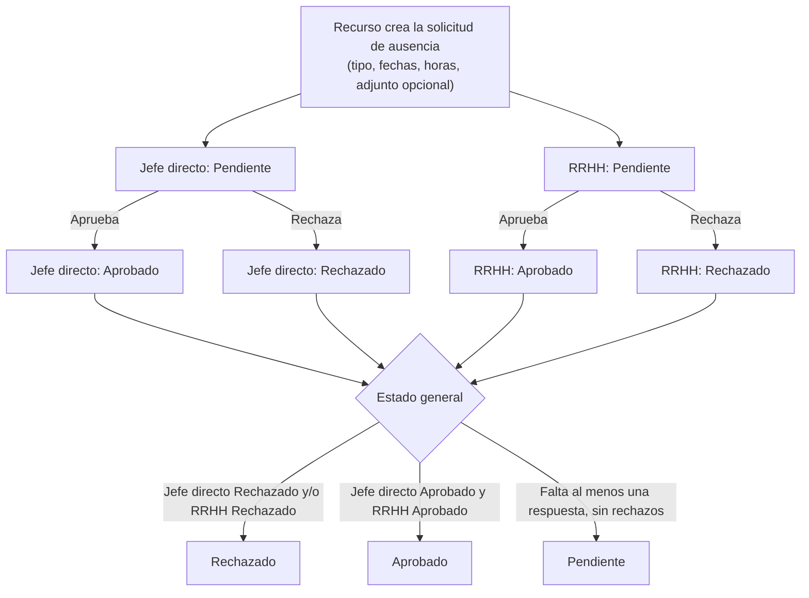
```mermaid
flowchart TD
    A["Recurso crea la solicitud de ausencia\n(tipo, fechas, horas, adjunto opcional)"] --> B["Jefe directo: Pendiente"]
    A --> C["RRHH: Pendiente"]
    B -->|Aprueba| B2["Jefe directo: Aprobado"]
    B -->|Rechaza| B3["Jefe directo: Rechazado"]
    C -->|Aprueba| C2["RRHH: Aprobado"]
    C -->|Rechaza| C3["RRHH: Rechazado"]
    B2 --> D{"Estado general"}
    B3 --> D
    C2 --> D
    C3 --> D
    D -->|"Jefe directo Rechazado y/o RRHH Rechazado"| E["Rechazado"]
    D -->|"Jefe directo Aprobado y RRHH Aprobado"| F["Aprobado"]
    D -->|"Falta al menos una respuesta, sin rechazos"| G["Pendiente"]
```

**Cómo leer este diagrama en la práctica**:

- La solicitud siempre muestra **tres estados en paralelo**: el del Jefe directo, el de RRHH, y el
  "Estado general" calculado a partir de los dos anteriores.
- Basta con que **uno** de los dos rechace para que el Estado general quede en **Rechazado**.
- Se necesita que **ambos** aprueben para que el Estado general pase a **Aprobado**.
- Si el recurso no tiene un Jefe directo configurado, esa mitad de la aprobación se considera
  resuelta automáticamente — en la práctica, la solicitud depende solo de RRHH.

> 💡 **Ejemplo real verificado**: en la pantalla **Permisos**, pestaña **"Mis solicitudes"**, hay una
> solicitud propia de tipo "Incapacidad médica" (2026-07-16 a 2026-07-17, día completo) con adjunto,
> cuyas tres columnas muestran `Jefe directo: Pendiente` · `RRHH: Pendiente` · `Estado general:
> Pendiente` — así se ve exactamente una solicitud recién creada, todavía sin ninguna de las dos
> aprobaciones. La pestaña **"Aprobaciones — Jefe directo"** es una tabla distinta (con columna
> adicional "Solicitante"): si no tienes personas a cargo, muestra "No hay solicitudes de tu equipo".

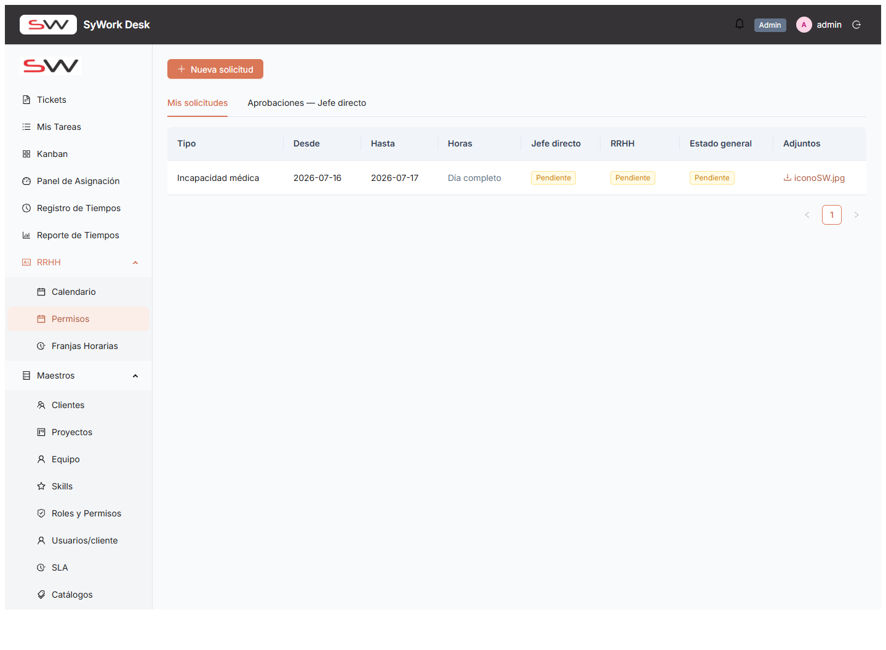

> ⚠️ **Advertencia — "Mi solicitud lleva días en Pendiente"**: revisa las columnas "Jefe directo" y
> "RRHH" por separado. Si una de las dos todavía está en Pendiente, la solicitud completa se queda
> en Pendiente aunque la otra ya haya respondido — hace falta que ambas respondan.

### 2.3 Regla de SLA: cuándo corre y cuándo se pausa el contador

El tiempo límite de un ticket (SLA) **no es un simple cronómetro de pared**: solo avanza mientras el
recurso asignado está realmente disponible para trabajar, según su calendario.

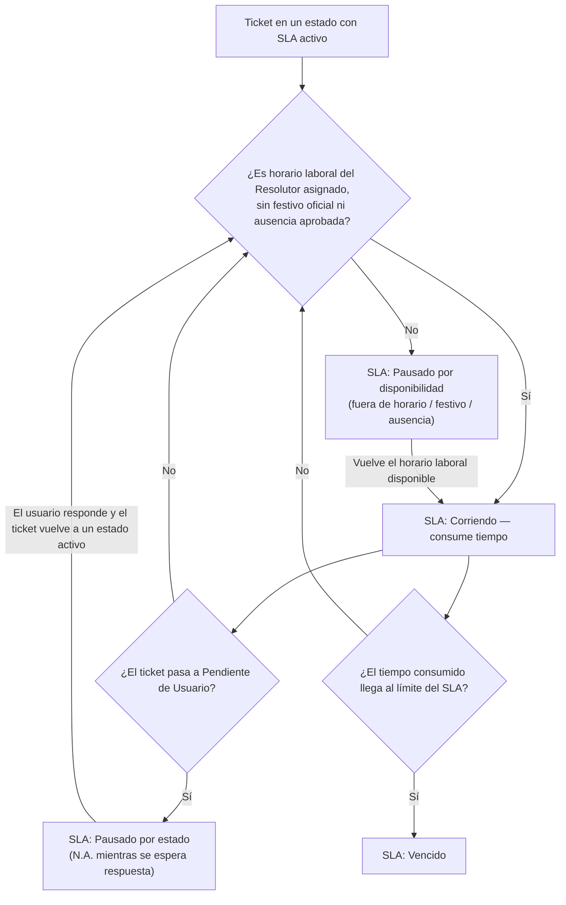
```mermaid
flowchart TD
    A["Ticket en un estado con SLA activo"] --> B{"¿Es horario laboral del Resolutor asignado,\nsin festivo oficial ni ausencia aprobada?"}
    B -->|Sí| C["SLA: Corriendo — consume tiempo"]
    B -->|No| D["SLA: Pausado por disponibilidad\n(fuera de horario / festivo / ausencia)"]
    C --> E{"¿El ticket pasa a Pendiente de Usuario?"}
    E -->|Sí| F["SLA: Pausado por estado\n(N.A. mientras se espera respuesta)"]
    E -->|No| B
    F -->|"El usuario responde y el ticket vuelve a un estado activo"| B
    D -->|"Vuelve el horario laboral disponible"| C
    C --> H{"¿El tiempo consumido llega al límite del SLA?"}
    H -->|Sí| I["SLA: Vencido"]
    H -->|No| B
```

**Cómo leer este diagrama en la práctica**:

- El SLA se pausa por **dos motivos distintos**, y ambos son normales, no errores:
  1. **Por disponibilidad**: fuera del horario laboral configurado para el país/recurso, en un
     festivo oficial, o durante una ausencia aprobada.
  2. **Por estado del ticket**: mientras el ticket está en **Pendiente de Usuario**, el contador se
     detiene por completo, sin importar el horario.
- Cuando el tiempo consumido (solo el tiempo "disponible", no el reloj de pared) alcanza el límite
  configurado para esa fase, el estado pasa a **Vencido**.
- El límite de tiempo se configura por **Proyecto y Prioridad** en Maestros → SLA, en minutos (ej.
  15 min para Contacto y 120 min para Diagnóstico/Análisis/Ejecución en una regla de prioridad
  Crítica observada en el sistema).

> 💡 **Ejemplo real verificado**: el ticket `TK-000004` muestra en su tarjeta **SLA** el texto
> `22h 01m / 2h 00m — Vencido — Fase: Diagnóstico, Análisis y Ejecución · Contacto: Cumplido (0m)` —
> es decir, la fase de Contacto sí se cumplió a tiempo, pero la fase de Diagnóstico/Análisis/Ejecución
> superó su límite de 2 horas y quedó **Vencido**.

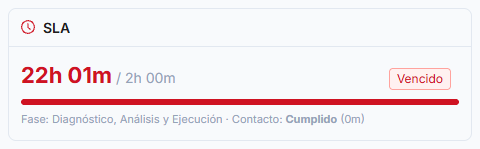

> 💡 **Nota**: en el **Historial de estados** del ticket, cada transición muestra el tiempo
> transcurrido en la fase anterior y, cuando aplica, un ícono de cumplimiento:
> **✅** si esa fase cumplió su SLA, o **⚠️** si lo incumplió. Si una fase todavía no tiene una
> evaluación de SLA disponible, simplemente no se muestra ícono — no significa que haya un error.

---

## 3. Guía Paso a Paso de Módulos

> Cada apartado describe la pantalla y **qué hace cada botón/campo relevante**. Los nombres de
> pantalla, botón y columna citados aquí son los que verás **literalmente** en el sistema — se
> verificaron navegando la aplicación real, no solo leyendo el código.

### 3.1 Panel General (barra de navegación)

Es el "marco" que envuelve todas las pantallas: encabezado superior + menú lateral.

- **Encabezado**: logo y nombre "SyWork Desk" a la izquierda; a la derecha, la campana de
  notificaciones, tu avatar con tu nombre y rol, y el botón de cerrar sesión.
- **Menú lateral**, en este orden exacto:
  - **Tickets**, **Mis Tareas**, **Kanban**, **Panel de Asignación**.
  - **Registro de Tiempos**, **Reporte de Tiempos**.
  - **RRHH** (grupo desplegable): **Calendario**, **Permisos**, **Franjas Horarias**.
  - **Maestros** (grupo desplegable): **Clientes**, **Proyectos**, **Equipo**, **Skills**,
    **Roles y Permisos**, **Usuarios/cliente**, **SLA**, **Catálogos**.
- Los ítems que no correspondan a tu rol/permiso simplemente no aparecen en el menú — no es
  necesario "activarlos".

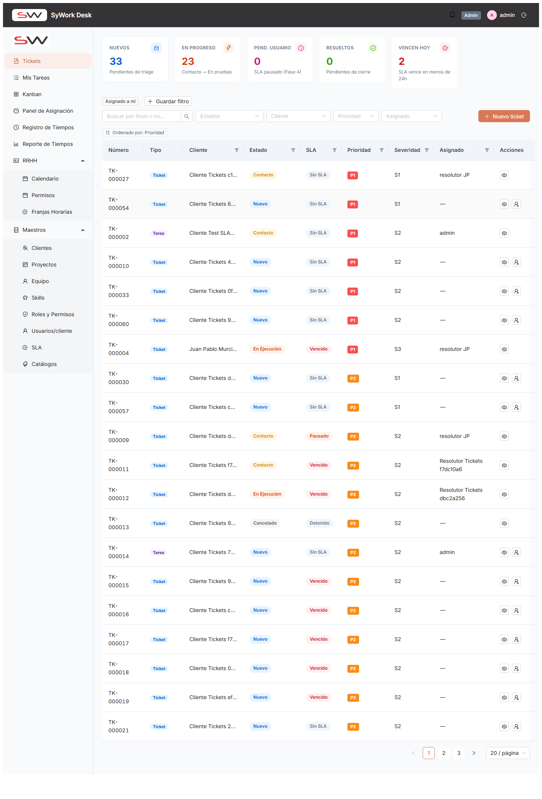

### 3.2 Tickets (listado principal)

Es la pantalla a la que llegas justo después de iniciar sesión — el punto de partida del día a día.

- **Tarjetas de resumen** en la parte superior: **Nuevos** (pendientes de triage), **En progreso**
  (Contacto → En pruebas), **Pend. Usuario** (SLA pausado), **Resueltos** (pendientes de cierre) y
  **Vencen hoy** (SLA vence en menos de 24 h). Son contadores en vivo, no botones.
- **Filtros**: interruptor "Asignado a mí", botón "Guardar filtro", y selectores de Estados,
  Cliente, Prioridad y Asignado.
- **Botón "Nuevo ticket"** para crear un registro.
- **Tabla**, ordenable ("Ordenado por: Prioridad"), con columnas: Número, Tipo (Ticket/Tarea),
  Título, Cliente, Estado, SLA, Prioridad, Severidad, Asignado, Acciones.


### 3.3 Kanban

Tablero visual del ciclo de vida del ticket, con una columna por estado (ver diagrama de la sección
2.1) y una tarjeta por ticket. El propio sistema resume su función con esta frase, visible en la
parte superior de la pantalla:

> *"Arrastra una tarjeta a otra columna para avanzarla; solo se permiten los movimientos válidos
> del flujo."*

- **Arrastrar una tarjeta** de una columna a otra dispara el mismo cambio de estado que se haría
  desde el Detalle de Ticket — es una forma visual de hacer la misma acción, no un flujo aparte.
- Cada tarjeta muestra número de ticket, tipo (si es Tarea), título, prioridad y el avatar del
  resolutor asignado (o "Sin asignar").
- Filtros por Estados, Asignado, Prioridad y Nivel, más el interruptor "Asignado a mí".
- Click sobre una tarjeta abre el **Detalle de Ticket** (sección 3.6).


> ⚠️ **Advertencia**: si arrastras una tarjeta a una columna y no sucede nada, revisa que la
> transición sea una de las permitidas en el diagrama de la sección 2.1 — el sistema solo permite
> los cambios de estado explícitamente definidos.

### 3.4 Mis Tareas

Listado personal de los tickets/tareas asignados al usuario conectado.

| Columna | Qué muestra |
|---------|-------------|
| Número | Número correlativo del ticket/tarea |
| Tipo | Si es un Ticket o una Tarea |
| Título | Título del registro |
| Cliente | Cliente al que pertenece |
| Estado | Estado actual (ver catálogo de la sección 2.1) |
| Prioridad | Crítica / Alta / Media / Baja |
| Sev. | Severidad (abreviada) |
| Acciones | Accesos directos (ej. abrir el detalle) |

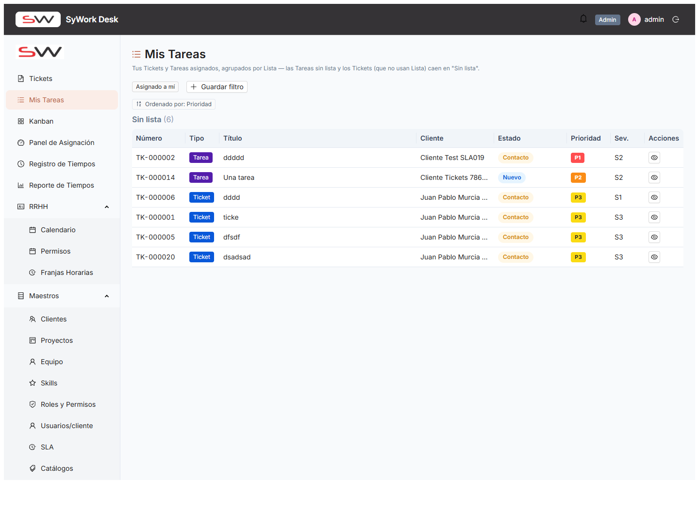

### 3.5 Panel de Asignación

Vista de apoyo para el Coordinador: muestra de un vistazo **quién tiene cuánta carga** y **qué
tickets siguen sin asignar**.

- **Matriz "Carga por resolutor y estado"**: una fila por resolutor (avatar con iniciales + nombre)
  y una columna por cada estado del ciclo de vida (Nuevo, Pre-Análisis, Contacto, En Análisis, En
  Ejecución, En Pruebas, Pendiente de Usuario, Resuelto), más una columna **Total**. Permite ver de
  un vistazo, por ejemplo, que un resolutor tiene 4 tickets en Contacto y 1 en En Ejecución.
- **Filtro "Filtrar estados"** y botón **"Actualizar"**.
- **Lista "Pendientes de triage (NUEVO)"**: los tickets sin asignar todavía, con columnas Número,
  Título, Prioridad, Cliente — el mismo universo que la columna "Nuevo" del Kanban.

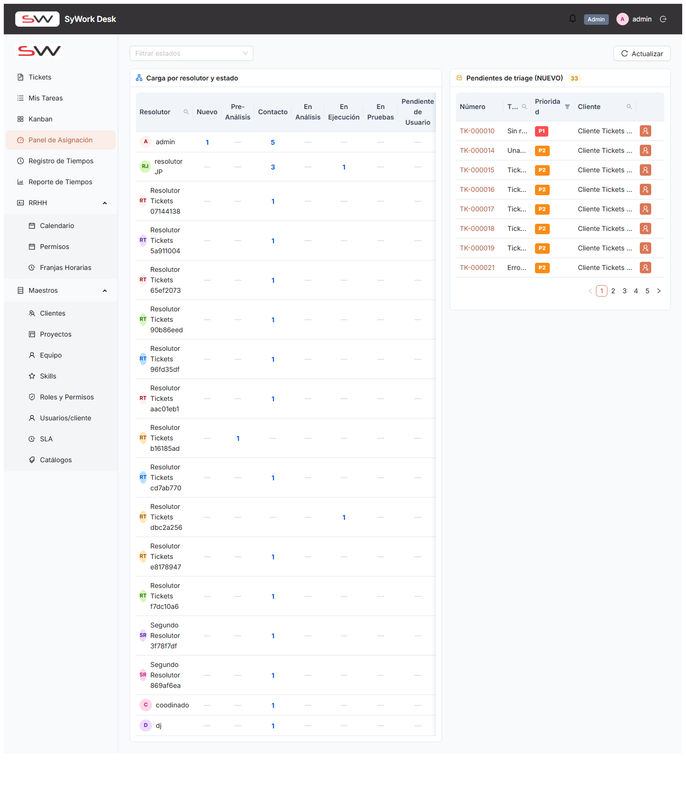

### 3.6 Detalle de Ticket

La pantalla más completa del sistema — todo lo relacionado a un ticket vive aquí.

| Sección de la pantalla | Qué hace / qué muestra |
|--------------------------|---------------------------|
| Botón **Asignar** (encabezado) | Abre el diálogo "Asignar ticket (Triage Push)" — o "Enviar a Pre-Análisis (QM)" si corresponde — para asignar el ticket por primera vez |
| **Descripción** | Texto del ticket y sus adjuntos, con enlace de descarga por archivo |
| **Registros de tiempo** | Cronómetro ("Iniciar"), tiempo total registrado y tiempo estimado; botón "Registrar tiempo" |
| **Comentarios y acciones** | Hilo de comentarios (con marca "interno" o "visible al cliente"); los de tipo estructurado (Asignado, Confirmación de atención, Solicitud de información, Respuesta de usuario, Solicitud de cierre, etc.) disparan el cambio de estado (sección 2.1). Incluye botones de acción como "Pasar a pruebas" y "Cancelar ticket", y un campo aparte para "Comentario interno (sin cambio de estado)" con adjuntos hasta 10 MB c/u |
| **Historial de estados** | Cada transición, con fecha/hora, tiempo en la fase anterior y el ícono de cumplimiento de SLA (✅/⚠️, ver sección 2.3) |
| **Reasignaciones** | Si el ticket cambió de resolutor, aquí queda el registro visible: `resolutor anterior ➡️ nuevo resolutor`, con fecha y motivo si se indicó |
| **SLA** | Tiempo consumido / límite, estado del contador (Corriendo / Pausado / Vencido) y detalle por fase |
| **Sesión de trabajo (Focus Room)** | Botón deshabilitado — funcionalidad futura (Fase 7 del roadmap), "Tiempo efectivo dedicado a este ticket" |
| **Clasificación** | Cliente, Usuario/cliente solicitante, Proyecto, Tipo de registro, Registro relacionado, Tipo, Nivel de escalamiento, Asignado, Prioridad, Severidad, Skills requeridas, Fecha de inicio, Tiempo estimado de solución, Creado — y el ícono **Reasignar a otro resolutor** junto al campo Asignado |
| **Subtareas** | Subtareas asociadas (Nivel 5 de la jerarquía Cliente → Proyecto → Lista → Ticket → Subtarea) |
| Botón **Guardar cambios** | Confirma las ediciones hechas en la tarjeta Clasificación |

> 💡 **Ejemplo real verificado** (`TK-000004`, "pribando", En Ejecución, Prioridad Crítica): la
> tarjeta Clasificación muestra "Usuario/cliente solicitante: Sin encargado asignado", "Nivel de
> escalamiento: N1" y "Skills requeridas: BSFN — JDE Business Functions (dev), JAVA_PYTHON_REACT —
> Java / Python / React (genérico)" — así se ve un ticket con requisitos de skill ya definidos.

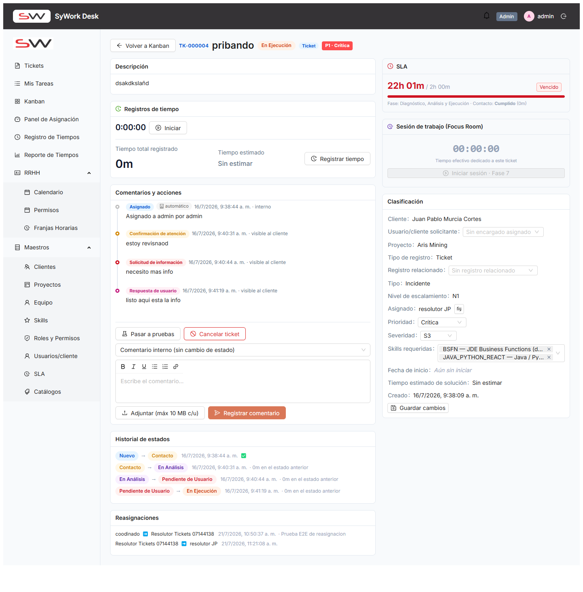

#### Cómo reasignar un ticket a otro resolutor

1. En la tarjeta **Clasificación**, haz click en el ícono **Reasignar a otro resolutor** (junto al
   campo Asignado). Se abre el diálogo **"Reasignar ticket"**.
2. El diálogo muestra una grilla de candidatos con la **misma información de carga y disponibilidad**
   que se usa en la asignación inicial (Triage Push): buscador "Buscar resolutor...", etiqueta
   **Menor carga** sobre quien tiene menos tickets activos, y la barra "Carga actual" por cada
   candidato.
3. Si un candidato no está disponible en este momento, aparece una etiqueta roja con el motivo:
   **Fuera de horario**, **Festivo** o **Ausencia aprobada**. Esta etiqueta es solo informativa — **no
   impide seleccionarlo** si igual decides asignarlo.
4. Selecciona el nuevo resolutor, opcionalmente escribe el **motivo de la reasignación**, y confirma
   con el botón **Reasignar**.
5. El ticket **no cambia de estado** por reasignarse — solo cambia quién lo atiende, y el cambio
   queda registrado en la tarjeta "Reasignaciones".

> 💡 **Ejemplo real verificado**: el ticket `TK-000004` tiene **dos** reasignaciones encadenadas en
> su historial: `coodinado ➡️ Resolutor Tickets 07144138` (motivo: "Prueba E2E de reasignacion") y
> luego `Resolutor Tickets 07144138 ➡️ resolutor JP`, cada una con su fecha y hora — así se ve el
> registro cuando un ticket pasa por más de un resolutor.

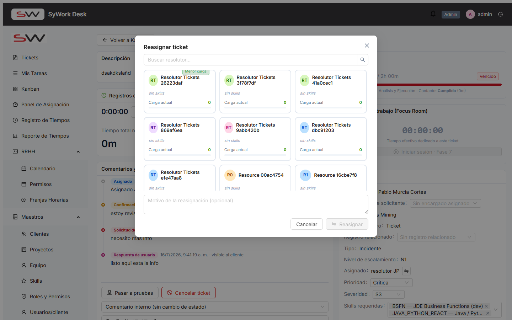

> ⚠️ **Advertencia — "No veo el botón Reasignar"**: la reasignación requiere que el ticket ya tenga
> un resolutor asignado (no aparece en un ticket sin asignar todavía) y que tu rol tenga el permiso
> correspondiente. Si el ticket es nuevo, usa primero el botón **Asignar**.
>
> ⚠️ **Advertencia**: si el nuevo resolutor no tiene todas las skills que pide el ticket, el sistema
> igual permite la reasignación pero te avisa qué skills le faltan — es una alerta, no un bloqueo.

### 3.7 Vista del rol Usuario/cliente

Cuando quien se conecta tiene el rol **Usuario/cliente** (usuario externo asociado a un cliente, dado
de alta desde Maestros → Usuarios/cliente), el sistema muestra la misma pantalla de **Tickets**, pero
con permisos reducidos — según su definición oficial en Roles y Permisos: *"solo crea y ve sus propios
tickets"*.

- El menú lateral **no incluye Maestros ni RRHH** — solo lo necesario para seguir sus propios
  tickets.
- Solo ve los tickets de **su propio cliente/proyecto**, nunca los del resto de la cartera.
- Puede comentar y adjuntar información a sus tickets, y responder cuando un ticket queda en
  **Pendiente de Usuario**.
- No puede reasignar, cambiar prioridad/severidad, ni acceder a los datos internos de SLA o carga
  de trabajo del equipo — esas acciones son exclusivas del personal interno.


*Vista real de un usuario con rol Usuario/cliente — cuenta de demostración creada para esta captura.*

> 💡 **Cómo se generó esta captura**: se creó un usuario de demostración (`contacto.demo`) desde
> **Maestros → Usuarios/cliente**, asociado al proyecto "Aris Mining", y se inició sesión con la
> contraseña provisional que la propia pantalla mostró una única vez al crearlo. El paso está
> automatizado en `scripts/manual-screenshots/capture.js` (pasos "Alta Usuario/cliente demo" y
> "24-vista-usuario-cliente"); la contraseña generada quedó documentada en
> `docs/credenciales_dev.txt` junto a las demás credenciales semilla (solo entorno de desarrollo).

> 💡 **Nota**: si necesitas dar de alta o corregir a un usuario de rol Usuario/cliente, eso se hace
> desde **Maestros → Usuarios/cliente** (pantalla de uso interno, no la que ve el cliente) — ver
> sección 3.10.6.

### 3.8 Módulo de RRHH

Agrupa tres pantallas bajo el menú **RRHH**:

#### 3.8.1 Calendario

Tiene **dos pestañas**:

- **Cliente**: elige un cliente para ver su calendario de festivos.
- **Equipo**: elige uno o más recursos (o "Seleccionar todo") para ver su calendario superpuesto en
  vista **month / week / day**, con esta leyenda de colores: **Festivo oficial**, **Regional /
  religioso**, **Cumpleaños**. Debajo del calendario, un panel por recurso muestra en minutos el
  tiempo **"Comprometido (min)"** y **"Disponible hoy (min)"** — la misma disponibilidad que se
  usa para calcular el SLA (sección 2.3) y para las sugerencias de Asignación/Reasignación.
- Botón **"Solicitar permiso"**, acceso directo a la pantalla Permisos.

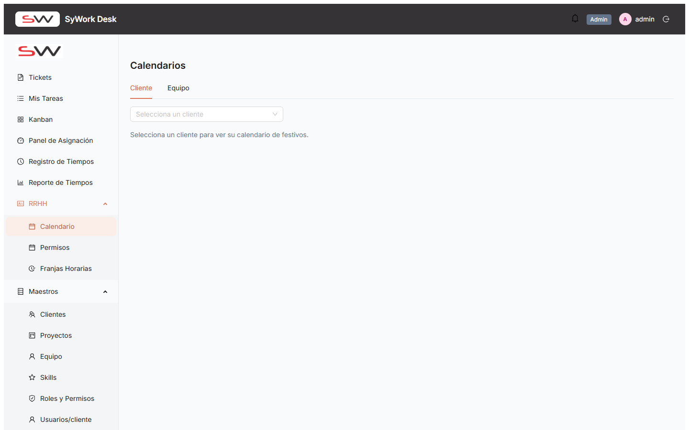

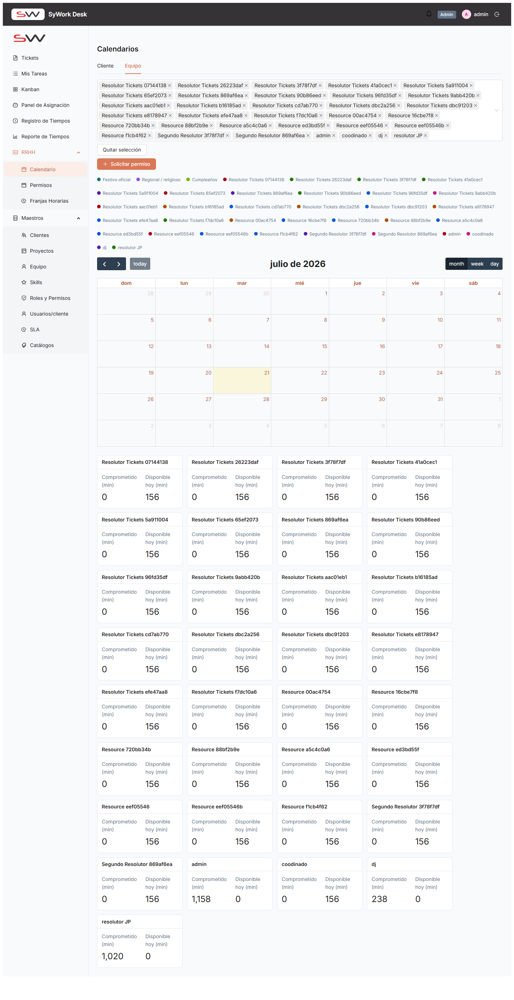

#### 3.8.2 Permisos

- Botón **"Nueva solicitud"** para pedir una ausencia propia.
- Pestaña **"Mis solicitudes"**: tabla con columnas Tipo, Desde, Hasta, Horas, Jefe directo, RRHH,
  Estado general, Adjuntos (ver ejemplo real en la sección 2.2).
- Pestaña **"Aprobaciones — Jefe directo"**: misma idea pero para el equipo a tu cargo, con una
  columna adicional **Solicitante** y **Acciones** para aprobar/rechazar. Si no tienes personas a
  cargo, muestra el mensaje "No hay solicitudes de tu equipo".
- Si tu rol es RRHH, aparece además una bandeja de aprobación equivalente para RRHH.

#### 3.8.3 Franjas Horarias

> *"Plantillas globales de horario laboral por país. Todo recurso en modo 'Heredado' sigue
> automáticamente los cambios de su Franja asignada."* — texto tal cual visible en la pantalla.

- Tabla de plantillas por país (ej. "Colombia"), con columnas Nombre, Huso horario, Horario, Estado,
  Acciones, y botón **"Nueva Franja Horaria"**.
- Sección **"Recursos en modo Personalizado"**: lista los recursos que editaron su propio horario y
  quedaron excluidos de las actualizaciones masivas de la Franja de su país (columnas Recurso, País).

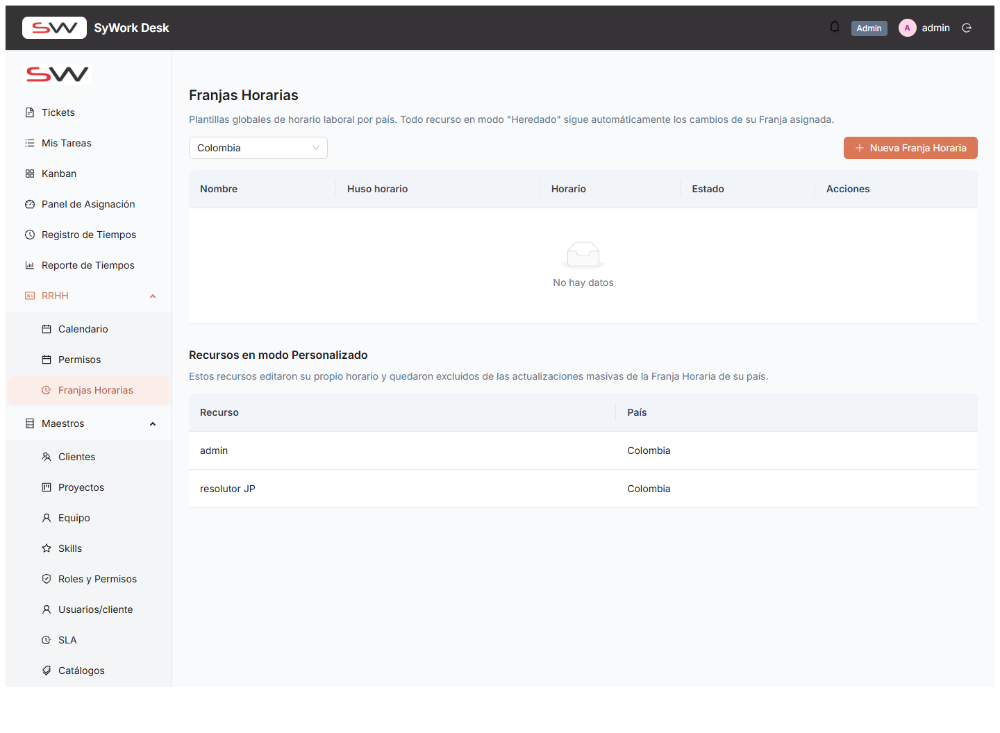

> 💡 **Nota**: si cambias una Franja Horaria, el efecto se ve reflejado tanto en el **Calendario**
> como en las etiquetas de disponibilidad de **Asignación/Reasignación** y en el cálculo del **SLA** —
> son la misma fuente de datos vista desde tres pantallas distintas.

### 3.9 Registro de Tiempos y Reporte de Tiempos

Dos pantallas separadas, ambas bajo el grupo de navegación de Tickets:

- **Registro de Tiempos**: muestra el **"Total registrado hoy"** y una tabla con columnas Ticket,
  Fecha, Duración, Nota, Acciones; botón **"Nuevo registro"** para cargar tiempo manualmente sobre
  un ticket.
- **Reporte de Tiempos**: selector de resolutor, **"Total del período"**, y una tabla día por día
  (Fecha, Total, Estado) — cuando no hay registros ese día, el Estado se muestra como **"Sin
  registro"**.

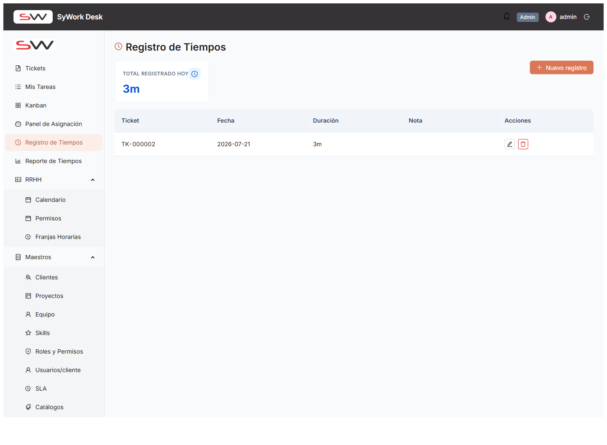

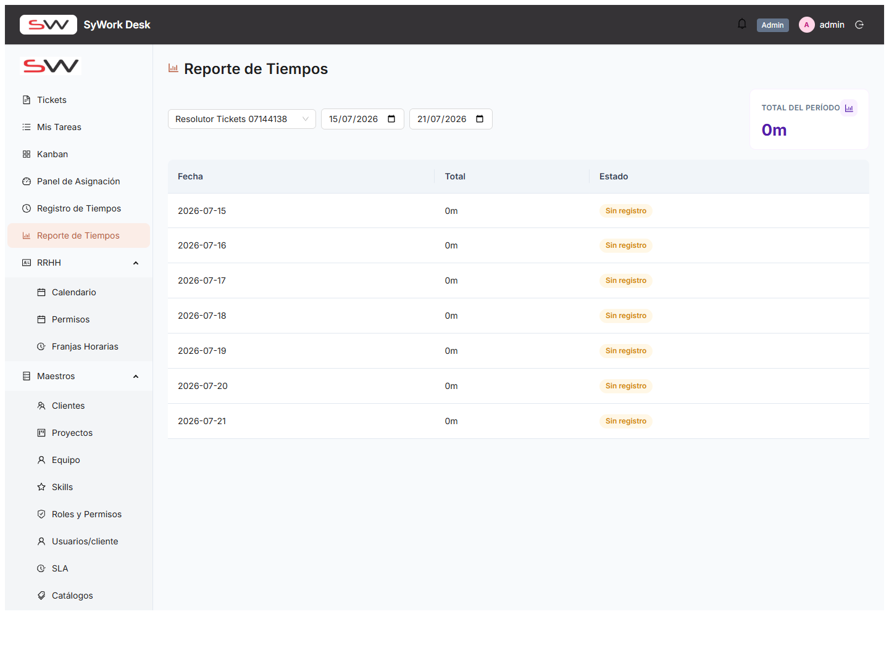

### 3.10 Maestros

Ocho pantallas de configuración, todas bajo el grupo **Maestros** del menú lateral.

#### 3.10.1 Clientes

Tabla con columnas Nombre, Contacto, Email, Estado, Acciones; botón **"Nuevo cliente"**.

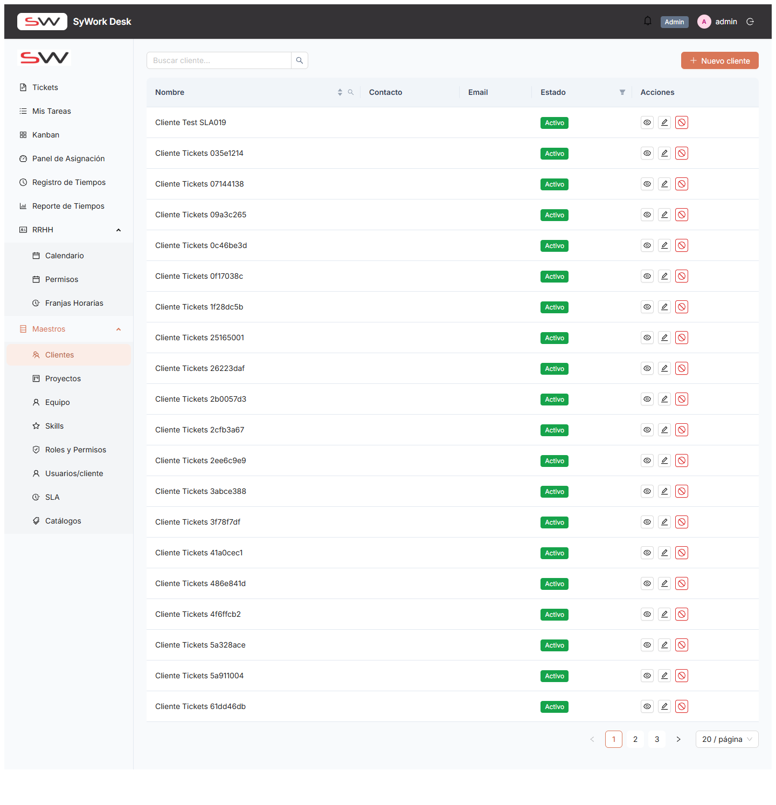

#### 3.10.2 Proyectos

Tabla con columnas Nombre, Cliente, Inicio, Fin estimado, Estado, Acciones; filtro "Filtrar por
cliente" y botón **"Nuevo proyecto"**. Cada fila tiene dos accesos adicionales:

- **Listas** (`/projects/:id/lists`): breadcrumb "‹Proyecto› › Listas", botón "Nueva lista"; al
  elegir una lista se ven sus tareas (mensaje "Elegí una Lista para ver sus Tareas" si no hay
  ninguna seleccionada).
- **Personal** (`/projects/:id/people`): breadcrumb "‹Proyecto› › Personal", pestañas "Personas (N)"
  y "Equipos (N)", botón "Asignar personal", tabla con columnas Nombre, Correo electrónico, Tipo,
  Fecha añadida.

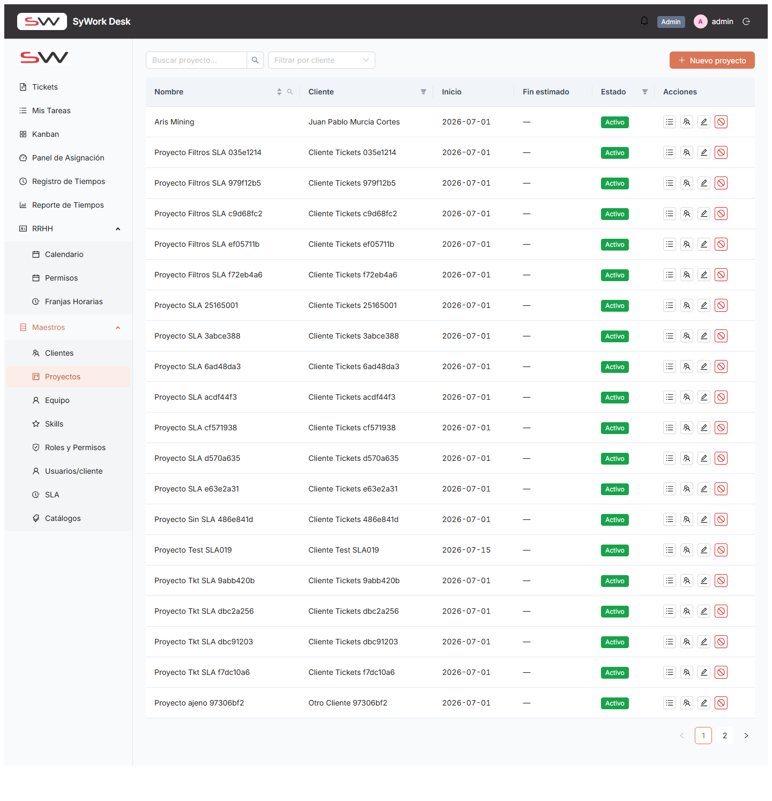

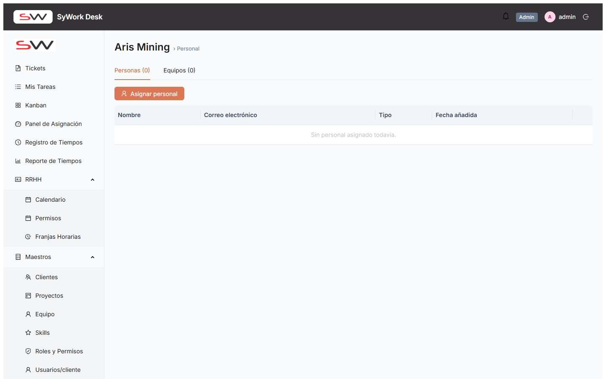

#### 3.10.3 Equipo

Tabla con columnas Nombre, Email, Rol, Skills, Estado, Acciones; botón **"Nuevo integrante"**. Los
recursos sin ficha completa muestran la leyenda "Sin perfil de recurso" bajo su nombre.

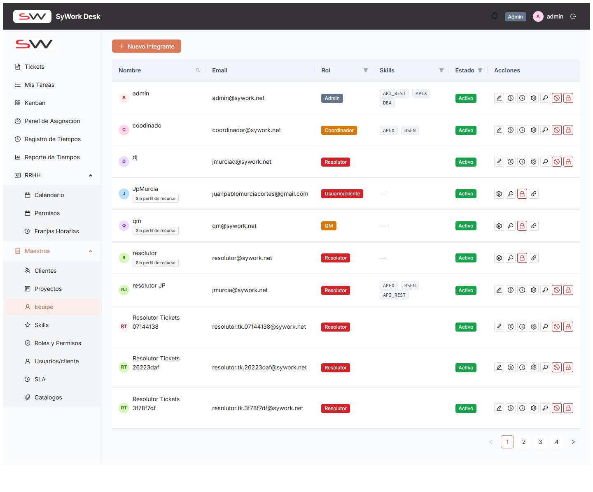

#### 3.10.4 Skills

Tabla con columnas Código (ej. `JDE_GL`, `API_REST`), Nombre, Tipo (Técnico / Funcional),
Herramienta, Proceso, Estado, Acciones; botón **"Nuevo skill"**.

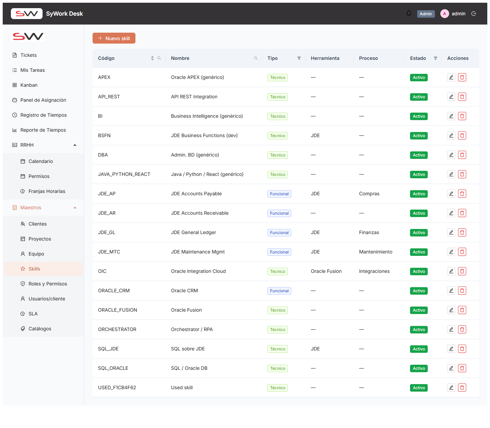

#### 3.10.5 Roles y Permisos

Tabla con columnas Nombre, Descripción, Permisos (cantidad), Estado, Acciones; botón **"Nuevo
rol"**. Aquí es donde se define qué ve y qué puede hacer cada rol mencionado en la sección 1.1.

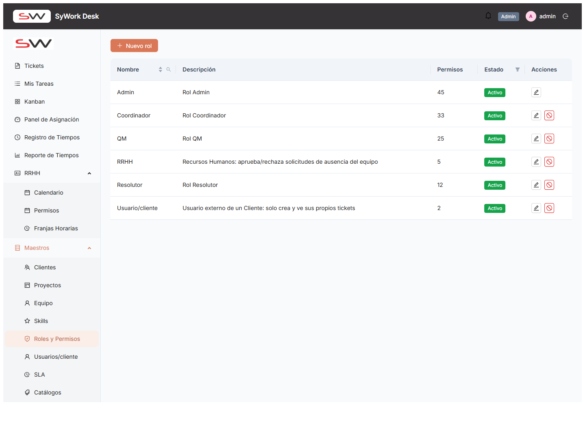

#### 3.10.6 Usuarios/cliente

Tabla con columnas Email, Usuario, Cliente, Proyectos, Alta, Acciones; filtro "Filtrar por cliente"
y botón **"Nuevo Usuario/cliente"**. La acción **"Gestionar proyectos"** define a qué proyectos de
su cliente tiene acceso ese usuario (ver spec 015, "Encargado en múltiples Proyectos").

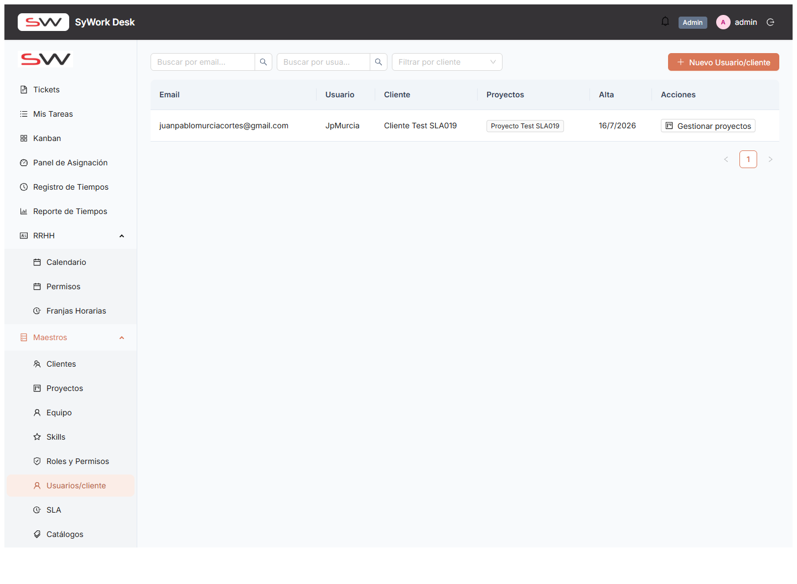

#### 3.10.7 SLA

Tabla con columnas Proyecto, Prioridad, Contacto (min), Diagnóstico/Análisis/Ejecución (min),
Estado, Acciones (Activar/Desactivar); filtro "Filtrar por proyecto" y botón **"Nueva regla de
SLA"**. Los tiempos se guardan en minutos (spec 019 permite cargarlos en horas/días y los convierte).

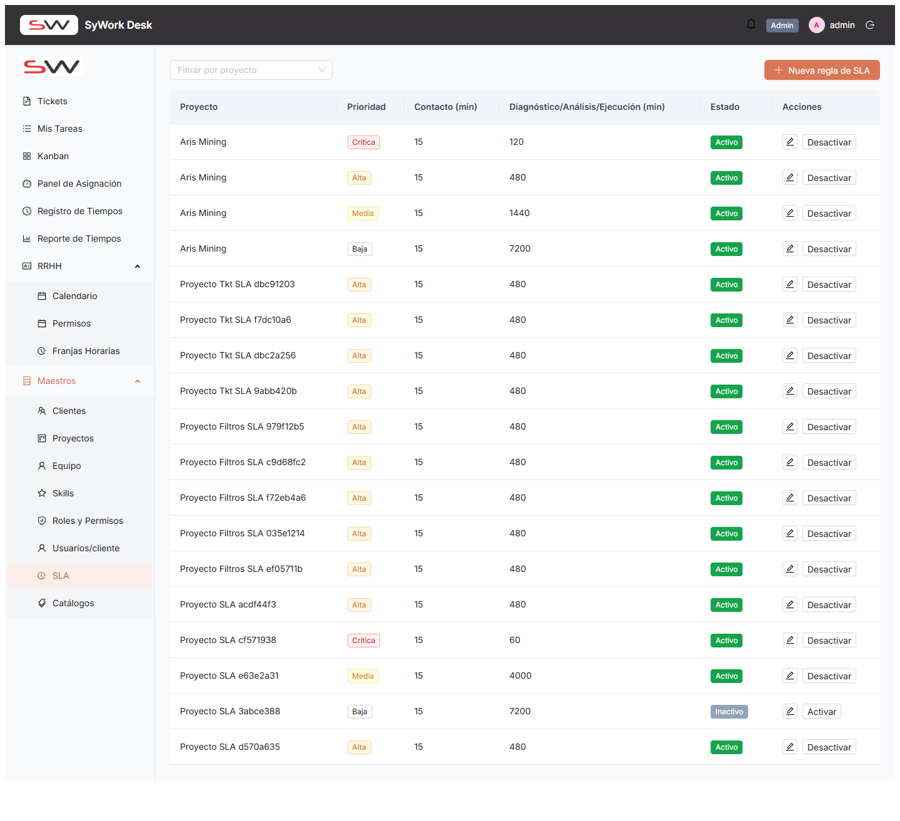

#### 3.10.8 Catálogos

Cinco listas simples de valores, cada una con columnas Nombre/Estado y su propio botón
**"Agregar"**: **Herramientas** (ej. JDE, OTM, Oracle Fusion), **Procesos** (ej. Compras, Finanzas,
Logística), **Tipos de resolución** (ej. Solución definitiva, Workaround), **Tipo de registro**
(Ticket / Tarea) y **Equipos de trabajo** (ej. Oracle EBS, Data & Analytics).

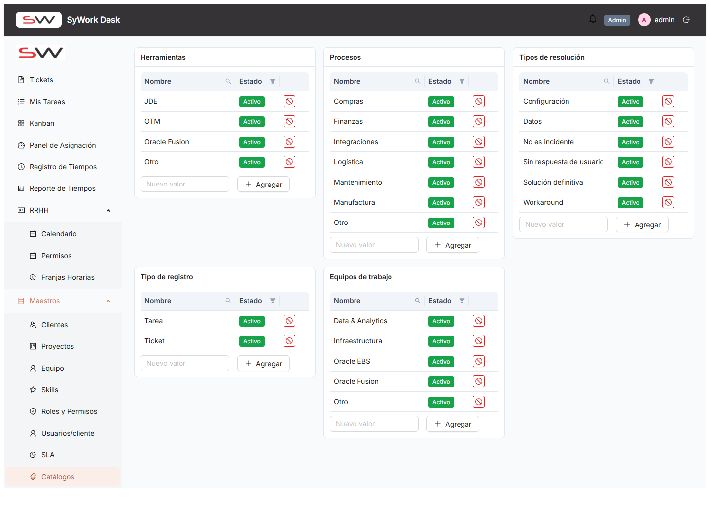

### 3.11 Mi Perfil

Accesible desde el avatar del encabezado. Muestra tu propia ficha de recurso, organizada en
pestañas: **Datos de contacto**, **Skills**, **Tickets asignados (N)**. Entre los campos: 
Identificación, Nacionalidad, Fecha de nacimiento, Estado civil, Tipo de contrato, País calendario,
Nivel de estudios, Especialidad, Seniority, Equipo, Certificaciones, Notas, y **Horario laboral**
(Heredado o Personalizado — ver sección 3.8.3). Botones **"Editar mis datos"** y **"Editar mi
horario laboral"**.

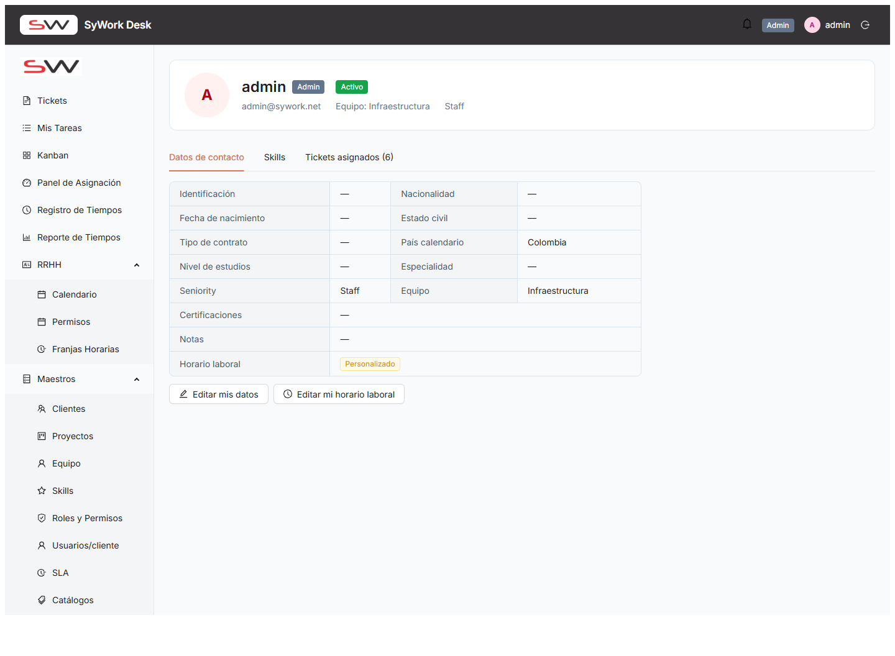

### 3.12 Acceso: Iniciar sesión y Reseteo de contraseña

- **Iniciar sesión**: correo o usuario + contraseña (cuenta `@sywork.net`), enlace "¿Olvidaste tu
  contraseña?" y opción "Continuar con Google" (SSO restringido al dominio de la empresa).
- **Reseteo de contraseña**: pantalla aparte a la que se llega desde ese enlace, para definir una
  nueva contraseña con el token recibido por correo.

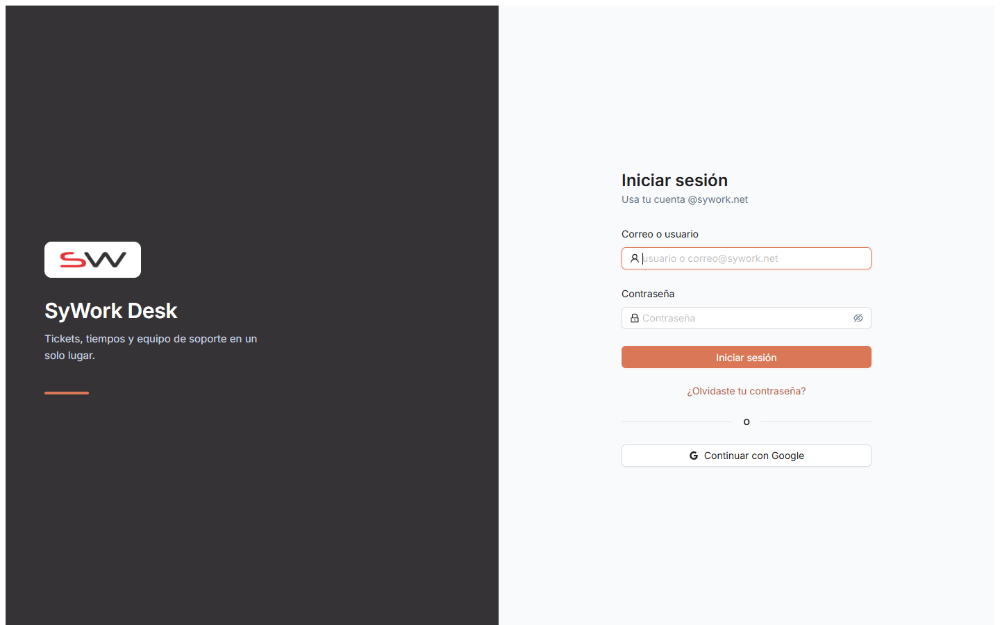

---

## 4. Ayuda Rápida

### 4.1 Acciones frecuentes

| Quiero... | Dónde lo hago |
|-----------|----------------|
| Crear un ticket nuevo | Tickets → botón **Nuevo ticket** |
| Asignar un ticket sin resolutor | Detalle de Ticket → botón **Asignar** |
| Cambiar el resolutor de un ticket ya asignado | Detalle de Ticket → Clasificación → ícono **Reasignar a otro resolutor** |
| Ver cuánto tiempo llevo dedicado a un ticket | Detalle de Ticket → tarjeta **Registros de tiempo** |
| Ver si un ticket está en riesgo de incumplir el SLA | Detalle de Ticket → tarjeta **SLA**, o el ícono ⚠️ en el **Historial de estados** |
| Ver quién tiene más/menos carga de trabajo | **Panel de Asignación** → matriz "Carga por resolutor y estado" |
| Pedir vacaciones o un permiso | RRHH → Permisos → **Nueva solicitud** |
| Aprobar una ausencia de mi equipo | RRHH → Permisos → pestaña **Aprobaciones — Jefe directo** |
| Ver por qué un resolutor aparece "no disponible" | Pasa el mouse sobre la etiqueta roja en el diálogo de asignación/reasignación |
| Cambiar el horario laboral de un país o recurso | RRHH → Franjas Horarias |
| Dar de alta un cliente, proyecto, skill o rol nuevo | Maestros → la pantalla correspondiente → botón "Nuevo..." |
| Dar de alta o corregir un usuario externo de un cliente | Maestros → **Usuarios/cliente** → **Nuevo Usuario/cliente** |

### 4.2 Íconos y etiquetas más comunes

| Ícono / etiqueta | Significado |
|-------------------|--------------|
| ✅ (en Historial de estados) | Esa fase del ticket cumplió su SLA |
| ⚠️ (en Historial de estados) | Esa fase del ticket incumplió su SLA |
| **Menor carga** (etiqueta verde) | El resolutor con menos tickets activos en este momento, entre los candidatos mostrados |
| **Fuera de horario** / **Festivo** / **Ausencia aprobada** (etiqueta roja) | El resolutor no está disponible ahora mismo por ese motivo — no impide seleccionarlo |
| 🎂 (en el Calendario) | Cumpleaños de un recurso |
| ➡️ (en Reasignaciones) | Separa el resolutor anterior del nuevo resolutor en el historial |
| "Sin perfil de recurso" (en Equipo) | El usuario existe pero todavía no tiene ficha completa de recurso |
| "Sin registro" (en Reporte de Tiempos) | Ese día no tiene ninguna sesión de trabajo cargada |

---

## 5. Notas y advertencias comunes

> 💡 **Nota — El manual y la app siempre deben coincidir en nombres**: si ves un nombre de estado,
> rol o botón distinto al descrito aquí, es señal de que el sistema evolucionó después de esta
> versión del manual (2026-07-21) — revisa la spec más reciente en `specs/` antes de asumir un error.

> ⚠️ **Advertencia — "No veo el botón Reasignar"**: revisa (1) que el ticket ya tenga resolutor
> asignado y (2) que tu rol tenga el permiso de reasignación en Roles y Permisos.

> ⚠️ **Advertencia — "El SLA no avanza"**: no es necesariamente un error. Revisa si el ticket está en
> **Pendiente de Usuario** (pausa total) o si es fuera del horario laboral, festivo o ausencia del
> resolutor asignado (pausa por disponibilidad) — ver sección 2.3.

> ⚠️ **Advertencia — "Mi solicitud de ausencia sigue en Pendiente"**: revisa por separado el estado
> de "Jefe directo" y de "RRHH" — ambos deben aprobar para que el Estado general quede Aprobado.

> ⚠️ **Advertencia — "No puedo ver los Maestros ni RRHH"**: es esperado si tu usuario tiene el rol
> **Usuario/cliente** (sección 3.7); esos módulos son de uso interno.

> ⚠️ **Advertencia — "Un recurso aparece con 0 minutos disponibles hoy"**: revisa su Franja Horaria
> (sección 3.8.3) — si está fuera de su horario laboral configurado para hoy, o tiene una ausencia
> aprobada, el sistema lo refleja como disponibilidad 0, tanto en el Calendario de equipo como en
> los diálogos de Asignación/Reasignación.

---

## 6. Glosario corto

| Término | Significado |
|---------|-------------|
| **Triage Push** | El flujo de asignación inicial de un ticket a un resolutor, con sugerencias de carga y disponibilidad |
| **SLA** | Tiempo límite acordado para cada fase de atención de un ticket, según Proyecto y Prioridad |
| **Usuario/cliente** | Rol de usuario externo asociado a un cliente; solo crea y ve sus propios tickets |
| **Jefe directo** | Relación de gestión entre recursos (no un rol): quien aprueba las ausencias del equipo a su cargo |
| **QM** | Rol que atiende el Pre-Análisis de un ticket antes de asignarlo a un Resolutor |
| **Focus Room** | Modo de trabajo enfocado en un solo ticket con asistente IA — funcionalidad futura (Fase 7), hoy visible pero deshabilitada |
| **Comprometido / Disponible hoy (min)** | Minutos ya ocupados y minutos aún libres de un recurso en el día, según su Franja Horaria y sus tickets/ausencias |

---

## 7. Qué está vigente hoy y qué es roadmap futuro

Este manual documenta únicamente lo **implementado hasta la spec 024** (reasignación con
sugerencias de carga y disponibilidad). Se mencionan a continuación, solo como contexto, las
funcionalidades del roadmap que **todavía no están activas** y que por lo tanto no tienen guía de
uso en este documento:

- **Motor FSM automatizado** con disparo automático de transiciones (Fase 6).
- **Focus Room** y agente IA asistente del Resolutor (Fase 7) — visible como botón deshabilitado en
  el Detalle de Ticket (sección 3.6).
- **Portal de clientes** e integraciones externas con creación automática de tickets (Fase 8).

Si alguna de estas funcionalidades aparece activa en el sistema, este manual quedará desactualizado
en ese punto y deberá revisarse contra la spec correspondiente en `specs/`.

---

## 8. Cómo se verificó este manual (y una limitación conocida)

Para esta versión 3.0, en lugar de describir las pantallas solo a partir del código fuente, se
navegó la aplicación real en el entorno Docker de desarrollo (`sywork_frontend` + `sywork_backend`),
iniciando sesión con el usuario semilla `admin`, para confirmar contra la interfaz real: nombres de
botones y columnas, roles y su descripción oficial, y ejemplos reales de ticket (`TK-000004`),
solicitudes de ausencia y reglas de SLA — todos citados en los recuadros "Ejemplo real verificado"
a lo largo de este documento. No se ejecutó la suite de pruebas automatizada (pytest/vitest) en
ningún momento, conforme al alcance de esta sesión.

Además, se hizo una segunda pasada de **verificación visual real** (viendo cada pantalla renderizada,
no solo su texto/DOM) sobre prácticamente la totalidad de la aplicación: Login, Tickets, Kanban,
Panel de Asignación, Detalle de Ticket (incluyendo el diálogo "Reasignar ticket"), Calendario
(pestañas Cliente y Equipo), Permisos (ambas pestañas), Franjas Horarias, SLA, Catálogos, Roles y
Permisos, Equipo, Usuarios/cliente, Clientes, Proyectos (incluida la vista "› Personal"), Skills, Mi
Perfil, Registro de Tiempos y Reporte de Tiempos. Esa revisión visual confirmó que todo el contenido
descrito coincide con la interfaz real, y corrigió un detalle: el ejemplo de "Incapacidad médica"
está en la pestaña **"Mis solicitudes"** de Permisos, no en "Aprobaciones — Jefe directo" (esa
pestaña es una tabla distinta, con columna "Solicitante", y para el usuario `admin` aparece vacía).

### 8.1 Capturas de pantalla reales

Todas las imágenes de este manual (`docs/screenshots/*.png`) se generaron con
[`scripts/manual-screenshots/capture.js`](../scripts/manual-screenshots/capture.js), un script
Node.js con **Puppeteer** que abre un navegador Chromium real, inicia sesión con el usuario semilla
`admin` y navega cada módulo clave de la aplicación en el entorno de desarrollo, guardando una
captura de pantalla completa (o recortada, para la tarjeta SLA) por pantalla. No forma parte del
backend/frontend de la aplicación — es una herramienta de documentación aparte, con su propio
`package.json`.

Para la **Vista del rol Usuario/cliente** (sección 3.7), como las credenciales semilla no incluyen
ningún usuario con ese rol, el script dedica dos pasos adicionales a resolverlo por su cuenta: da de
alta un usuario de demostración (`contacto.demo`) desde **Maestros → Usuarios/cliente**, lee la
contraseña provisional que la propia pantalla muestra una única vez, la documenta en
`docs/credenciales_dev.txt` y la usa para iniciar sesión y capturar esa vista. Por eso una
reejecución completa del script solo funciona una vez — si el contacto demo ya existe, ese paso falla
a propósito para no crear duplicados (reutiliza la contraseña ya documentada).

Para regenerar las capturas (por ejemplo, tras un cambio visual):

```bash
cd scripts/manual-screenshots
pnpm install       # primera vez únicamente
BASE_URL=http://localhost:5173 pnpm run capture
```
