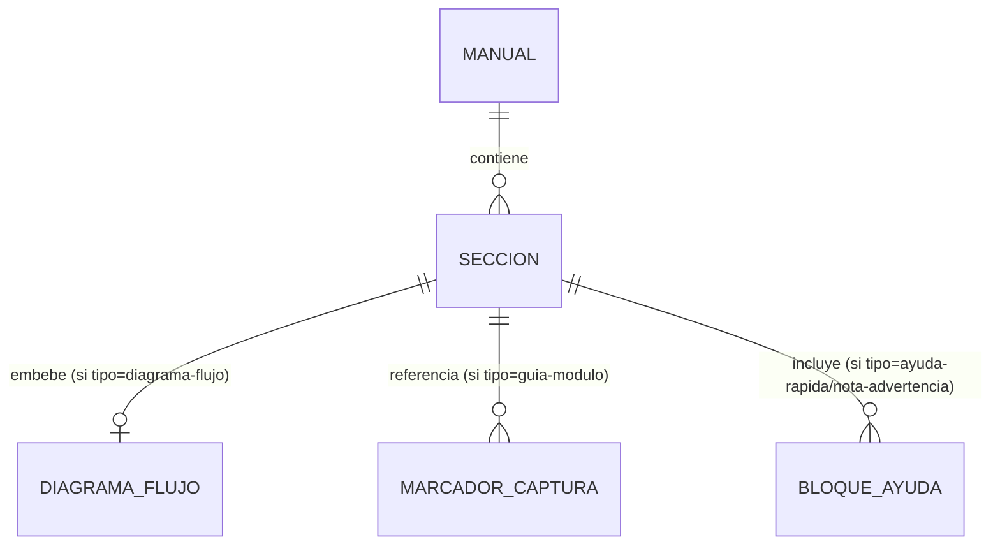

# Data Model: Actualización Integral del Manual de Usuario

**Feature**: [spec.md](spec.md) | **Plan**: [plan.md](plan.md)

Esta feature no crea entidades de base de datos ni modelos de dominio. El "modelo de datos" aquí es
la estructura documental del manual: las unidades de contenido que componen
`docs/Manual_de_Usuario.md` y cómo se relacionan entre sí (equivalente a las "Key Entities" de la
spec).

## Entidades documentales

### Sección del Manual

Bloque de contenido de nivel de encabezado (`##`/`###`) con un propósito único.

| Campo | Descripción |
|-------|-------------|
| `titulo` | Encabezado visible de la sección (ej. "Ciclo de vida de un Ticket") |
| `tipo` | `resumen-arquitectonico` \| `diagrama-flujo` \| `guia-modulo` \| `ayuda-rapida` \| `nota-advertencia` |
| `audiencia` | Rol(es) principal(es) al que se dirige (Coordinador, Resolutor, QM, RRHH, Encargado/Cliente, Administrador, todos) |
| `contenido` | Texto en lenguaje amigable, viñetas, tablas y/o diagrama Mermaid embebido |
| `marcadores_captura` | Lista de referencias a Marcador de Captura asociadas a esta sección (0..N) |

### Diagrama de Flujo

Representación Mermaid de un proceso de negocio, embebida dentro de una Sección del Manual de tipo
`diagrama-flujo`.

| Campo | Descripción |
|-------|-------------|
| `nombre` | Uno de: `ciclo-vida-ticket`, `aprobacion-vacaciones`, `regla-sla` |
| `sintaxis` | Mermaid (`flowchart TD` o equivalente) |
| `fuente_terminologica` | Referencia a la sección de la Constitución (`.specify/memory/constitution.md`) o spec de la que se derivan los estados/roles usados, para trazabilidad (FR-012) |
| `estados_o_pasos` | Lista ordenada de nodos del diagrama (estados del ticket, pasos de aprobación, o fases de la regla SLA) |

**Relación**: cada Diagrama de Flujo pertenece exactamente a una Sección del Manual de tipo
`diagrama-flujo`; las tres instancias requeridas (FR-002, FR-003, FR-004) son fijas y no se generan
dinámicamente.

### Marcador de Captura

Referencia textual dentro de una Sección del Manual de tipo `guia-modulo` que indica dónde debe
insertarse una imagen real de pantalla.

| Campo | Descripción |
|-------|-------------|
| `formato` | `[INSERTAR CAPTURA: <descripcion>]` (convención fijada en research.md, Decisión 5) |
| `descripcion` | Qué debe verse en la captura (pantalla, estado de los datos, elemento resaltado) |
| `elementos_a_explicar` | Lista de botones/campos que el texto adyacente debe describir |
| `vista_origen` | Una de las 6 vistas en alcance: Dashboard, Kanban, Mis Tareas, Detalle de Ticket, Vista del Cliente/Encargado, Módulo de RRHH |

**Relación**: cada Marcador de Captura pertenece a exactamente una Sección del Manual de tipo
`guia-modulo`; una sección puede tener 1..N marcadores (SC-002 exige al menos uno por vista).

### Bloque de Ayuda Rápida / Nota-Advertencia

Elemento de referencia corta o de aviso de error común, no ligado a una única vista.

| Campo | Descripción |
|-------|-------------|
| `tipo` | `tabla-ayuda-rapida` \| `nota` \| `advertencia` |
| `titulo` | Ej. "¿No ves el botón Reasignar?" |
| `contenido` | Explicación breve y accionable |
| `vinculado_a` | Sección(es) del Manual relacionadas (opcional) |

## Diagrama de relaciones

Sin reglas de transición de estado (no aplica FSM a este modelo documental) y sin validación de
datos en tiempo de ejecución — la "validación" es la revisión de contenido descrita en
[quickstart.md](quickstart.md).
